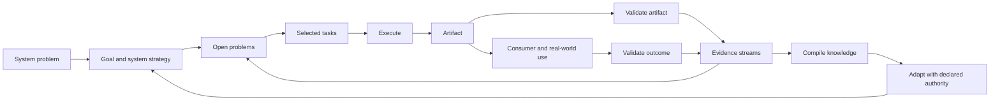

# Adaptive Problem Solving (APS)

Adaptive Problem Solving (APS) is a domain-independent method for
designing systems that repeatedly work on a defined problem, verify whether
their work changes it, learn from evidence, and improve how they solve it.

APS applies to software delivery, organizations, research, mathematics,
manufacturing, personal workflows, and systems whose job is to improve other
problem-solving systems. Each adaptive problem-solving system is a concrete
instantiation of the method. Systems may form a hierarchy that decomposes a
larger problem into problems owned by child systems. APS specifies the general
concepts and responsibilities that close each problem-solving loop; it does not
prescribe one workflow, storage technology, cadence, or management method.

This package is the normative framework specification. In this repository it is
the primary artifact produced by the separately declared
[APS Framework Operations System](../operations/SYSTEM.md). Changes to the
normative package are summarized in [CHANGELOG.md](CHANGELOG.md). Exact
meanings for recurring terms are consolidated in the normative
[APS vocabulary](VOCABULARY.md).

## Why APS exists

Many efforts define a goal and an execution process but leave the feedback loop
implicit. They may produce outputs without checking whether those outputs solve
the consumer's problem; collect observations without compiling them; or write
lessons without changing the next operation. The result is activity that repeats
without becoming more effective.

APS makes the complete loop explicit and inspectable:



The phases are responsibilities, not a mandatory sequence. A system may run
them synchronously, asynchronously, continuously, on events, on a schedule, in
parallel, or in another problem-appropriate arrangement. Its current arrangement
is part of its strategy and may itself evolve.

## Core definitions

### System problem, goal, strategy, and open problem

- **System problem** — the condition the system exists to change, including the
  affected consumer or environment.
- **Goal** — a current, bounded result that reduces the system problem. It is
  stated in the independent system-strategy document.
- **System strategy** — the system's current theory and approach for reaching
  its current goal: how it interprets evidence, identifies and chooses among open
  problems, guides their strategies, plans, executes, validates, learns, and
  coordinates its subsystems. `SYSTEM.md` links it through `strategy` to the
  sibling `STRATEGY.md` document. Strategy is allowed to change
  when evidence warrants it.
- **Problem strategy** — the current approach for resolving or reducing one
  open problem. It lives in that problem's file, is informed by the system
  strategy, guides selected tasks, and changes when its signal or other evidence
  contradicts the approach.
- **Open problem** — an evidenced, unresolved condition within the system that
  obstructs or threatens a current goal. It names a gap, not a proposed
  solution or an automatically authorized task.

The system problem is the durable reason the system exists; goals bound what
matters now; open problems retain the current gaps between the present state
and those goals. Feedback and other evidence may reveal or change an open
problem. The system strategy governs how the system interprets those inputs and
chooses problems; each problem strategy describes how to approach its gap.
Selected tasks implement that strategy, and verification shows whether the
problem improved. See [VOCABULARY.md](VOCABULARY.md) for the exact boundaries
among these and related terms.

### System and subsystem

An **adaptive problem-solving system** is one concrete instantiation of APS.
It owns a problem statement and an iterative loop for solving that problem. In
that loop it uses strategy to guide work planning and execution, takes in
information from relevant streams, verifies whether its attempts improve the
problem, grooms information through evidence-aware processing and decision
making, compiles reusable knowledge, and adapts a later attempt. Verification
acts as the loop's value function: it evaluates an attempt against the problem
and supplies a qualitative or quantitative signal for the next optimization
step. An attempt may produce an inspectable artifact when the problem context
calls for one, but a separately named artifact is not part of the system's
identity.

These are responsibilities of the system, not a required sequence of separate
processes or components. Each system defines the processes that implement
them; those processes may be combined, reordered, or supported by other
participants while the system remains accountable for using the resulting
evidence and closing its loop.

Loop ownership does not require every action or approval to reside inside the
system boundary. The system's processes define who performs and authorizes each
step.

A **subsystem** is a child system used to decompose part of its parent's
problem. The originating problem definition, strategy, or process links to the
child; the child does not declare a parent. The child owns its problem-solving
loop even when the decomposing system supplies feedback, verification, or
insights. If an entity is only part of how a system operates rather than an
instantiation responsible for a problem-solving loop, model it as a **process**
or **capability** instead.

APS does not prescribe a lifecycle process, including whether solving a
system's problem retires it or causes another transition. The system defines
how it responds.

### Artifact and outcome

An **artifact** is an inspectable output produced by a system. It may be:

- digital, such as code or a deployed application;
- informational, such as a wiki, plan, research report, or test result;
- decisional, such as an approved strategy or design;
- formal, such as a mathematical proof;
- physical, such as a CNC-machined part; or
- a recorded state transition, such as a reconciled database or restored
  operating condition.

The **outcome** is the change the artifact should cause for its consumer or
environment. Artifact and outcome must not be conflated: a part may match its
CAD tolerances and still fail in use; software may pass every test and still not
help its user.

### Process and work session

A **process** is a reusable method for performing a kind of work. It describes
how the work is done independently of one invocation.

A system declares the repeatable **work sessions** it can invoke. Each
declaration has a stable `id`, a concise `description`, and a link to the
`process` that defines how the work is done. The process filename should match
the work-session ID where practical.

APS does not prescribe particular work-session types. Each system lists the
types it offers; the linked processes define their behavior. A system with no
bounded session types declares an empty list.

A concrete work session is one bounded invocation of a declared work session.
It may be synchronous or asynchronous and may be performed by people, agents,
machines, or delegated systems. Event-driven and continuous operation can use a
meaningful invocation or observation boundary, but the linked process must make
completion or handoff inspectable.

Retain one record for a material work-session invocation in a declared
working-session stream or its native system of record. The record identifies
the session, date, participants, affected problems and tasks, material evidence
or decisions, and stopping point. It preserves what happened; problem and task
files remain authoritative for current state.

The session record or other native recoverable source preserves material
discussion and links to changed state. Do not create a second summary when the
native record is already durable.

### Stream, raw evidence, and compiled knowledge

- An **information stream** is a source of observations relevant to the system:
  working-session records, meetings, customer threads, runtime logs, test results, feedback,
  research, experiments, or another system's artifacts.
- **Raw evidence** is source material kept recoverable whenever possible. It may
  be copied into the system or referenced in an external system of record.
- **Compiled knowledge** is a reusable synthesis derived from evidence: a wiki,
  playbook, model, set of heuristics, or another knowledge artifact.

A durable record is an implementation choice for retaining one item from or
about those streams, not another required APS primitive. Discussion summaries,
reports, and observations preserve evidence; insights state participant or
operator inference linked to evidence; questions preserve unresolved
uncertainty; and approved decisions are decisional artifacts. These roles may
share one source record or use separate linked records when they need distinct
lifecycles. Retaining any of them does not by itself make it executable work.

Streams and work sessions therefore have complementary roles: streams make
inputs and observations available; work sessions deliberately process or act
on selected inputs; produced evidence may return to declared streams for later
sessions. A meeting can be both the source named by a stream and a work-session
invocation, while its retained summary is evidence carried by that stream.

Raw evidence remains available because a later strategy or question may make a
previously ignored detail important. Compiled knowledge is therefore revisable
and, where useful, reproducible from old and new evidence. Repository-backed
systems can rely on git for detailed provenance; the compiled artifact needs a
simple changelog, not a duplicate manifest for every compilation.

## The complete adaptive loop

Every APS instance must implement all of these responsibilities. Their exact
ordering, cadence, concurrency, tooling, and resource budget belong to the
system's strategy. Work sessions may support this loop, but the system remains
responsible for every phase whether it combines or separates their processes.

### 1. Orient and frame

Read the current system problem, goal and system strategy, open problems
and their strategies, relevant direction, relevant compiled
knowledge, and new evidence. Confirm that the system is still solving the right
problem and that its current problems and approaches remain relevant to its
goals.

### 2. Groom problems and select tasks

The system strategy states the current goal and guides problem selection.
Maintain one file per active problem under `problems/`:

```markdown
---
id: P1
type: open-problem
status: open
opened: YYYY-MM-DD
---

# <Observed condition obstructing or threatening the goal>

## Goal
<Current goal from the system strategy.>

## Evidence
<Observation or recoverable source indicating the gap exists.>

## Desired change
<What would meaningfully improve.>

## Signal
<Evidence of worsening, improvement, or sufficient resolution.>

## Strategy
<Current approach for resolving or reducing this problem.>

## Grooming history
<Material evidence, decisions, rationale, sources, and next triggers.>
```

New problems may be proposed when feedback, validation, research, insights,
changed direction, or completed work reveals a gap. Feedback is
evidence, not an automatic problem: problem grooming interprets the evidence and
frames the condition without embedding a preferred solution.

An open problem is the long-running unit of improvement. It may remain open
across many working sessions and tasks while its evidence, signal, and strategy
evolve. Do not turn the whole desired change of a problem into one umbrella
task.

Groom a problem by asking:

1. Which current goal does it obstruct or threaten?
2. What evidence indicates that it exists?
3. What is the impact if it remains unresolved?
4. What change and signal would demonstrate improvement?
5. What strategy should approach it, and what evidence would challenge that
   strategy?
6. Why address it now rather than another open problem?

Grooming supports three lightweight decisions: address it now, keep it open
without current work, or close it with a recorded reason. No numerical scoring
method is required. On closure, record the evidence and reason in the problem
file, set `status: closed`, and move it under `problems/archive/`.

Maintain one file per executable response under `tasks/`:

```markdown
---
id: T1
type: task
status: selected
addresses: [P1]
owner: <responsible role>
created: YYYY-MM-DD
---

# <Action>

## Intended result
<Observable result this task should produce.>

## Approach
<How this task implements or tests the problem strategy.>

## Stop condition
<Acceptance, handoff, or reconsideration condition.>

## Current state
<What has happened, what remains uncertain, and the next step.>
```

A task is a bounded executable response that implements or tests part of an
open problem's strategy, including implementation, research, experiment,
discussion, review, or remediation. Prefer a task that produces one inspectable
result in one working session. If it contains several independently reviewable
results or stopping points, split it before selection. A task must not duplicate
the whole problem or depend on problem closure as its own stop condition.

Status in the task file makes its state explicit. Keep `selected`,
`in-progress`, and `awaiting-review`
tasks directly under `tasks/`; keep `captured`, `grooming`, `ready`, and
`deferred` candidates under `tasks/backlog/`; move closed, cancelled,
rejected, merged, or superseded tasks under `tasks/archive/` with their final
reason. These folders are the current task collection; APS does not require a
separate plan or exhaustive index.

A task may be captured before its problem relationship is clear, but it is not
ready for selection until it addresses at least one current problem. The system
strategy informs problem grooming and constrains acceptable problem strategies;
selected tasks implement or test the addressed problem strategy rather than
becoming unrelated activity attached only by ID.

An active task file states enough current state and next-step information for
execution to resume across time, people, or agents. Material session history
belongs in working-session records; detailed repository history belongs in
version control; domain evidence remains in its native stream. APS does not
require a generic work log that duplicates those sources.

### 3. Resolve uncertainty

The system may invoke three general evidence-producing capabilities with
domain-specific protocols:

- **Discussion / grilling** — elicit knowledge, context, trade-offs, or judgment
  from a person or agent. Asynchronous meetings and customer threads qualify;
  their durable summaries enter declared evidence streams.
- **Research** — find and synthesize existing external knowledge.
- **Experimentation** — generate new evidence through prototypes, user trials,
  simulations, benchmarks, feasibility work, formal proof, theorem proving, or
  another deliberate test.

These capabilities may be implemented locally or delegated to shared systems.
### 4. Attempt a solution

Run the system's process and make a solution attempt. Retain material
decisions, deviations, failures, and successful results in the appropriate
current-state or evidence source. An attempt may produce contextual artifacts.

### 5. Verify the attempt

Use the system's value function to evaluate the attempt against its problem.
When an attempt produces an artifact, check the artifact as an input to that
evaluation rather than treating artifact completion as problem improvement.

### 6. Capture evidence

Preserve relevant raw observations and provenance through declared streams. Do
not turn missing information into fact. If a stream lacks context, record the
gap and invoke discussion, research, or experimentation when the answer is
load-bearing.

### 7. Compile knowledge

Run the system's implemented compilation process. The system decides when to
run it, what evidence to revisit, whether to update incrementally or recompile
more broadly, and how to allocate time, compute, token, or human attention.

### 8. Adapt

Use validated learning to improve open-problem framing, task selection,
strategy, goals, processes, streams, validation, knowledge, or subsystem
structure.
Adaptation follows the authority defined by the relevant process.

### 9. Continue, stop, or hand off

Trigger the next invocation, wait for an event or schedule, hand work to
another system, or end when the problem is solved. The linked process defines
the applicable behavior.

## Validation of problem change and contextual artifacts

Every system verifies whether its attempts improve its problem. When an attempt
produces a contextual artifact, the system also verifies that artifact before
using it as evidence of problem change. The checks may run at different times.

| Dimension | Question | Typical evidence |
|---|---|---|
| Artifact correctness | Did we produce the output correctly? | tests, review, inspection, proof, measurements |
| Outcome effectiveness | Did the output solve the consumer's problem? | use, behavior, feedback, field results, longitudinal measures |

An open-ended or continuously operating system may additionally define
**health/homeostasis** conditions: operating conditions it must maintain while
pursuing outcomes, such as cash flow, safety margin, latency, capacity, or error
rate. Health is an optional pattern, not a universal third validation field.

## Problem decomposition

Each system is identified by its name. APS does not require a separate system
ID, status, or parent declaration. A hierarchy is a view of problem
decomposition: when a problem is assigned to another system, the originating
problem definition, strategy, or process records that link. Lifecycle and
placement remain choices of those systems and processes rather than universal
declaration fields.

Problem-decomposition links explain why a child system exists. Other
cross-system interactions belong in the problems, strategies, processes, or
streams where they affect operation; APS does not require a universal relation
registry.

## Process participants and authority

APS does not require a system-wide role taxonomy or list. Each process defines
the people, agents, or systems that participate in it and states who performs,
reviews, validates, or approves its decisions. The same participant may act in
several processes, and a process may be human-operated, agent-operated,
automated, or mixed.

Participation does not imply authority. Each process makes its applicable
decision authority explicit rather than relying on a universal role name.

## Standard system capsule

A system capsule colocates its declaration with the strategies, processes, and
stream references needed to find its adaptive loop. One possible layout is:

```text
systems/
  <system>/
    SYSTEM.md
    STRATEGY.md
    processes/
      loop.md
      verification.md
    streams/
    problems/
    tasks/
```

Only the minimal `SYSTEM.md` fields are structurally required. The linked
strategy and process choose the physical layout and implement the remaining
loop concepts. Empty ceremonial directories add no value.

Child systems may live wherever their own definition and processes require.
The originating problem definition, strategy, or process links to the child by
system name; physical nesting is not required.

When a repository is itself a root system, its root may be the declared system
boundary. Alternatively, a repository may be a container holding an operational
system capsule beside its contextual outputs. This repository uses:

```text
framework/   normative APS method
operations/  producing system capsule, including SYSTEM.md
```

These are strategy choices, not required APS layouts. Every path referenced by
the declaration must resolve.

## Lightweight stream declarations

Streams are heterogeneous, so APS standardizes only a small interface:

```yaml
streams:
  - id: customer-discussions
    purpose: Learn where the current workflow creates friction.
    source: Async customer discussion threads.
    access: External system reference or retained summary.
    consumed_by: processes/compile-product-knowledge.md
    grill: processes/customer-feedback-grill.md
```

Systems may add retention, privacy, schema, normalization, or reliability fields
when their problem requires them. They are not universal framework ceremony.

## Work-session declarations

Each system lists its own work-session types. Every declaration contains a
local ID, description, and linked process:

```yaml
work_sessions:
  - id: brainstorming
    description: Discuss an idea, task, or research topic with the responsible user and iteratively compile reviewable changes into system knowledge or the system instantiation.
    process: processes/brainstorming.md
```

The process owns invocation, participants, evidence use, decisions, outputs,
stopping or observation boundaries, authority, and retention. The declaration
names a repeatable kind of work, not a historical invocation. Use an empty list
when the system has no bounded session types.

## Creating a system

1. **Name and frame it.** State the system name and problem.
2. **Declare verification.** Link the process that evaluates attempts against
   the problem.
3. **Declare strategy.** Link the system's current direction.
4. **Link the loop.** Point `process` to the process that implements planning,
   execution, learning, adaptation, participation, and authority.
5. **Declare work-session types.** List the bounded session types the system
   offers and link each defining process; use an empty list when there are none.
6. **Declare streams.** Name the information sources used by the loop.
7. **Connect decomposition when applicable.** Link another named system from
   the problem, strategy, or process that decomposes work to it.
8. **Run it once end to end.** A declared loop that has never produced,
   validated, learned, and adapted is a design hypothesis, not yet a proven
   adaptive system.

The human-readable declaration contract and template are in
[SCHEMA.md](SCHEMA.md). Framework Operations is the first concrete application
of the method.

## Assessing an existing system

An existing system conforms when a reviewer can answer all of these from its
capsule and referenced sources:

- What problem defines the system?
- Where is its current strategy?
- Which process implements its complete loop?
- Which bounded work-session types does it offer, if any?
- How does verification evaluate attempts against the problem?
- Which information streams does the loop use?
- Do the linked processes make planning, execution, learning, adaptation,
  participation, and authority inspectable?
- Which problem, strategy, or process links to another system when work is
  decomposed?

Missing answers are explicit design gaps. Do not invent a subsystem merely to
fill a diagram: either implement its full adaptive loop or keep the behavior as
a process/capability inside an accountable parent.

## Visual orientation

APS uses four complementary projections rather than one overloaded graph:

1. problem decomposition;
2. artifact flow from producer to consumer; and
3. evidence, compilation, and adaptation flow; and
4. stream-to-work-session processing.

The maps use the declaration plus linked strategies, problems, processes, and
streams. They are derived navigation aids and must lose to those sources on
conflict. Detailed conventions and examples are in
[VISUALIZATION.md](VISUALIZATION.md).

## What APS deliberately does not standardize

APS does not require a particular project-management method, database, wiki
tool, communication platform, orchestration engine, schedule, problem-scoring
method, external problem-management service, work or additional work-session
taxonomy, compilation algorithm, experiment type, or validation technique.
Those are strategy decisions made by each system in response to its problem,
context and available resources.

The framework standardizes the questions that make a problem-solving loop
complete, observable, improvable, and accountable.
