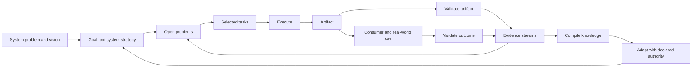

# Adaptive Problem-Solving Systems

Adaptive Problem-Solving Systems (APSS) is a domain-independent framework for
designing systems that repeatedly solve a defined problem, produce an artifact,
verify both the artifact and its real-world effect, preserve evidence, compile
reusable knowledge, and improve how they operate.

APSS applies to software delivery, organizations, research, mathematics,
manufacturing, personal workflows, and systems whose job is to improve other
problem-solving systems. It specifies the responsibilities that close the loop;
it does not prescribe one workflow, storage technology, cadence, or management
method.

This package is the normative framework specification. In this repository it is
the primary artifact produced by the separately declared
[APSS Framework Operations System](../operations/SYSTEM.md). Changes to the
normative package are summarized in [CHANGELOG.md](CHANGELOG.md). Exact
meanings for recurring terms are consolidated in the normative
[APSS vocabulary](VOCABULARY.md).

## Why APSS exists

Many efforts define a goal and an execution process but leave the feedback loop
implicit. They may produce outputs without checking whether those outputs solve
the consumer's problem; collect observations without compiling them; or write
lessons without changing the next operation. The result is activity that repeats
without becoming more effective.

APSS makes the complete loop explicit and inspectable:



The phases are responsibilities, not a mandatory sequence. A system may run
them synchronously, asynchronously, continuously, on events, on a schedule, in
parallel, or in another problem-appropriate arrangement. Its current arrangement
is part of its strategy and may itself evolve.

## Core definitions

### System problem, vision, goal, strategy, and open problem

- **System problem** — the condition the system exists to change, including the
  affected consumer or environment.
- **Vision** — the durable description of what better looks like if the problem
  is solved.
- **Goal** — a current, bounded result that moves the system toward its vision.
  It is stated in the independent system-strategy document.
- **System strategy** — the system's current theory and approach for reaching
  its current goal: how it interprets evidence, identifies and chooses among open
  problems, guides their strategies, plans, executes, validates, learns, and
  coordinates its subsystems. `SYSTEM.md` links it through `strategy` to the
  sibling `STRATEGY.md` document. Strategy is allowed to change
  when evidence warrants it.
- **Problem strategy** — the current approach for resolving or reducing one
  open problem. It lives in that problem's file, is informed by the system
  strategy, guides selected tasks, and changes when its signal or other evidence
  contradicts the approach.
- **Open problem** — an evidenced, unresolved condition within the system that
  obstructs or threatens a current goal. It names a gap, not a proposed
  solution or an automatically authorized task.

The system problem is the durable reason the system exists; goals bound what
matters now; open problems retain the current gaps between the present state
and those goals. Feedback and other evidence may reveal or change an open
problem. The system strategy governs how the system interprets those inputs and
chooses problems; each problem strategy describes how to approach its gap.
Selected tasks implement that strategy, and outcome validation shows whether the
problem improved. See [VOCABULARY.md](VOCABULARY.md) for the exact boundaries
among these and related terms.

### System and subsystem

An **adaptive problem-solving system** owns:

1. a distinct problem and boundary;
2. stable identity and lifecycle ownership;
3. roles and adaptation authority;
4. inputs, constraints, and evidence streams;
5. an independent system strategy, current open problems with their own
   strategies, task files with resumable state, and required work sessions;
6. a complete execution and feedback loop;
7. at least one primary artifact;
8. a consumer and intended outcome;
9. separate artifact and outcome validation;
10. compiled knowledge and a process that produces it; and
11. an adaptation process that changes future operation.

A **subsystem** is a system whose lifecycle is owned by exactly one parent
system. It still owns its complete adaptive loop. If an entity cannot justify
its own artifact, outcome, evidence, learning, and adaptation, model it as a
**process** or **capability** inside its parent instead of inventing a hollow
subsystem.

### Artifact and outcome

An **artifact** is an inspectable output produced by a system. It may be:

- digital, such as code or a deployed application;
- informational, such as a wiki, plan, research report, or test result;
- decisional, such as an approved strategy or design;
- formal, such as a mathematical proof;
- physical, such as a CNC-machined part; or
- a recorded state transition, such as a reconciled database or restored
  operating condition.

The **outcome** is the change the artifact should cause for its consumer or
environment. Artifact and outcome must not be conflated: a part may match its
CAD tolerances and still fail in use; software may pass every test and still not
help its user.

### Process and work session

A **process** is a reusable method for performing a kind of work. It describes
how the work is done independently of one invocation.

A system declares the repeatable **work sessions** it can invoke. Each
declaration has a stable `id`, a concise `description`, and a link to the
`process` that defines how the work is done. The process filename should match
the work-session ID where practical.

APSS defines two required work sessions:

- **Brainstorming** discusses an idea, task, or research topic with the
  responsible user, reads relevant evidence and knowledge, compiles proposed
  changes directly into the framework knowledge or concrete system
  instantiation, and iterates until an accepted stopping point. Its process is
  declared as `processes/brainstorming.md`.
- **Problem grooming** uses the system strategy to revisit one or more current
  open problems, evaluates their goal relevance, evidence, framing, strategy,
  desired change, and signal, then records an authorized retain, revise,
  address, or close result. Its process is declared as
  `processes/problem-grooming.md`.

A concrete work session is one bounded invocation of a declared work session.
It may be synchronous or asynchronous and may be performed by people, agents,
machines, or delegated systems. Event-driven and continuous operation can use a
meaningful invocation or observation boundary, but the linked process must make
completion or handoff inspectable.

Retain one record for a material work-session invocation in a declared
working-session stream or its native system of record. The record identifies
the session, date, participants, affected problems and tasks, material evidence
or decisions, and stopping point. It preserves what happened; problem and task
files remain authoritative for current state.

A brainstorming session consumes selected stream evidence, compiled knowledge,
tasks, constraints, or existing artifacts and produces reviewable changes to
the system's knowledge or instantiation. The authoritative artifact and its
simple changelog retain the accepted result; raw evidence remains in its source
streams.

A problem-grooming session consumes the system strategy, problem files,
selected evidence, current tasks, and applicable knowledge. Each affected
problem file retains the authoritative decision, rationale, and resulting
framing; affected task files retain their current state and next step. The
session record or other native recoverable source preserves material discussion
and links to the changed files. Do not create a second summary when the native
session record is already durable.

### Stream, raw evidence, and compiled knowledge

- An **information stream** is a source of observations relevant to the system:
  working-session records, meetings, customer threads, runtime logs, test results, feedback,
  research, experiments, or another system's artifacts.
- **Raw evidence** is source material kept recoverable whenever possible. It may
  be copied into the system or referenced in an external system of record.
- **Compiled knowledge** is a reusable synthesis derived from evidence: a wiki,
  playbook, model, set of heuristics, or another knowledge artifact.

A durable record is an implementation choice for retaining one item from or
about those streams, not another required APSS primitive. Discussion summaries,
reports, and observations preserve evidence; insights state participant or
operator inference linked to evidence; questions preserve unresolved
uncertainty; and approved decisions are decisional artifacts. These roles may
share one source record or use separate linked records when they need distinct
lifecycles. Retaining any of them does not by itself make it executable work.

Streams and work sessions therefore have complementary roles: streams make
inputs and observations available; work sessions deliberately process or act
on selected inputs; produced evidence may return to declared streams for later
sessions. A meeting can be both the source named by a stream and a work-session
invocation, while its retained summary is evidence carried by that stream.

Raw evidence remains available because a later strategy or question may make a
previously ignored detail important. Compiled knowledge is therefore revisable
and, where useful, reproducible from old and new evidence. Repository-backed
systems can rely on git for detailed provenance; the compiled artifact needs a
simple changelog, not a duplicate manifest for every compilation.

## The complete adaptive loop

Every APSS instance must implement all of these responsibilities. Their exact
ordering, cadence, concurrency, tooling, and resource budget belong to the
system's strategy. Work sessions may support this loop, but the system remains
responsible for every phase whether it combines or separates their processes.

### 1. Orient and frame

Read the current system problem, vision, goal and system strategy, open problems
and their strategies, constraints, parent direction, relevant compiled
knowledge, and new evidence. Confirm that the system is still solving the right
problem and that its current problems and approaches remain relevant to its
goals.

### 2. Groom problems and select tasks

The system strategy states the current goal and guides problem selection.
Maintain one file per active problem under `problems/`:

```markdown
---
id: P1
type: open-problem
status: open
opened: YYYY-MM-DD
---

# <Observed condition obstructing or threatening the goal>

## Goal
<Current goal from the system strategy.>

## Evidence
<Observation or recoverable source indicating the gap exists.>

## Desired change
<What would meaningfully improve.>

## Signal
<Evidence of worsening, improvement, or sufficient resolution.>

## Strategy
<Current approach for resolving or reducing this problem.>

## Grooming history
<Material evidence, decisions, rationale, sources, and next triggers.>
```

New problems may be proposed when feedback, validation, research, insights,
changed direction or constraints, or completed work reveals a gap. Feedback is
evidence, not an automatic problem: problem grooming interprets the evidence and
frames the condition without embedding a preferred solution.

An open problem is the long-running unit of improvement. It may remain open
across many working sessions and tasks while its evidence, signal, and strategy
evolve. Do not turn the whole desired change of a problem into one umbrella
task.

Groom a problem by asking:

1. Which current goal does it obstruct or threaten?
2. What evidence indicates that it exists?
3. What is the impact if it remains unresolved?
4. What change and signal would demonstrate improvement?
5. What strategy should approach it, and what evidence would challenge that
   strategy?
6. Why address it now rather than another open problem?

Grooming supports three lightweight decisions: address it now, keep it open
without current work, or close it with a recorded reason. No numerical scoring
method is required. On closure, record the evidence and reason in the problem
file, set `status: closed`, and move it under `problems/archive/`.

Maintain one file per executable response under `tasks/`:

```markdown
---
id: T1
type: task
status: selected
addresses: [P1]
owner: <responsible role>
created: YYYY-MM-DD
---

# <Action>

## Intended result
<Observable result this task should produce.>

## Approach
<How this task implements or tests the problem strategy.>

## Stop condition
<Acceptance, handoff, or reconsideration condition.>

## Current state
<What has happened, what remains uncertain, and the next step.>
```

A task is a bounded executable response that implements or tests part of an
open problem's strategy, including implementation, research, experiment,
discussion, review, or remediation. Prefer a task that produces one inspectable
result in one working session. If it contains several independently reviewable
results or stopping points, split it before selection. A task must not duplicate
the whole problem or depend on problem closure as its own stop condition.

Status in the task file makes its state explicit. Keep `selected`,
`in-progress`, and `awaiting-review`
tasks directly under `tasks/`; keep `captured`, `grooming`, `ready`, and
`deferred` candidates under `tasks/backlog/`; move closed, cancelled,
rejected, merged, or superseded tasks under `tasks/archive/` with their final
reason. These folders are the current task collection; APSS does not require a
separate plan or exhaustive index.

A task may be captured before its problem relationship is clear, but it is not
ready for selection until it addresses at least one current problem. The system
strategy informs problem grooming and constrains acceptable problem strategies;
selected tasks implement or test the addressed problem strategy rather than
becoming unrelated activity attached only by ID.

An active task file states enough current state and next-step information for
execution to resume across time, people, or agents. Material session history
belongs in working-session records; detailed repository history belongs in
version control; domain evidence remains in its native stream. APSS does not
require a generic work log that duplicates those sources.

### 3. Resolve uncertainty

The system may invoke three general evidence-producing capabilities with
domain-specific protocols:

- **Discussion / grilling** — elicit knowledge, context, trade-offs, or judgment
  from a person or agent. Asynchronous meetings and customer threads qualify;
  their durable summaries enter declared evidence streams.
- **Research** — find and synthesize existing external knowledge.
- **Experimentation** — generate new evidence through prototypes, user trials,
  simulations, benchmarks, feasibility work, formal proof, theorem proving, or
  another deliberate test.

These capabilities may be implemented locally or delegated to shared systems.
Brainstorming is the current work-session interface for discussing and
compiling a load-bearing idea, task, or research topic with the responsible
user; a system-specific protocol may include a particular grill.

### 4. Execute and produce

Run the system's process and produce the primary artifact plus any supporting
artifacts. Update the task's current state and next step. Retain material
decisions, deviations, failures, and successful resolutions in the session
record or appropriate evidence stream.

### 5. Validate the artifact

Verify that the output satisfies its specification or acceptance conditions.
The method depends on the problem: tests, inspection, review, proof checking,
measurement, tolerance analysis, or another fit-for-purpose check.

### 6. Validate the outcome

Verify separately that the artifact caused the intended effect for its consumer
or environment. Outcome validation may require observation over time and may be
asynchronous with artifact validation.

### 7. Capture evidence

Preserve relevant raw observations and provenance through declared streams. Do
not turn missing information into fact. If a stream lacks context, record the
gap and invoke discussion, research, or experimentation when the answer is
load-bearing.

### 8. Compile knowledge

Run the system's implemented compilation process. The system decides when to
run it, what evidence to revisit, whether to update incrementally or recompile
more broadly, and how to allocate time, compute, token, or human attention.

### 9. Adapt

Use validated learning to improve open-problem framing, task selection,
strategy, goals, processes, streams, validation, knowledge, or subsystem
structure.
Adaptation follows the authority declared by the system. The initial safe
default is human approval by the responsible owner; trusted systems may later
receive bounded autonomous authority.

### 10. Continue, stop, or hand off

Trigger the next invocation, wait for an event or schedule, hand an artifact to
another system, or end when the problem is solved. Open-ended systems continue
while their purpose remains valid.

## Validation has two mandatory dimensions

Every system declares both dimensions even if they run at different times.

| Dimension | Question | Typical evidence |
|---|---|---|
| Artifact correctness | Did we produce the output correctly? | tests, review, inspection, proof, measurements |
| Outcome effectiveness | Did the output solve the consumer's problem? | use, behavior, feedback, field results, longitudinal measures |

An open-ended or continuously operating system may additionally define
**health/homeostasis** conditions: viability constraints it must maintain while
pursuing outcomes, such as cash flow, safety margin, latency, capacity, or error
rate. Health is an optional pattern, not a universal third validation field.

## Hierarchy, ownership, and relationships

Every system has one stable ID independent of its path. A root has no parent;
every subsystem has exactly one primary parent. The parent owns the subsystem's
lifecycle: creation, placement, resource boundary, escalation, and retirement.

Systems may participate across the hierarchy through typed relationships. APSS
does not close the vocabulary, but common relations include:

- `feeds` — provides evidence or artifacts to another system;
- `verifies` / `verified_by` — validates another system or is validated by it;
- `invokes` — calls another system or capability;
- `depends_on` — requires another system's result;
- `scheduled_by` — receives its invocation from another system;
- `governed_by` — operates under another system's authority; and
- `improves` — adapts another declared target with permission.

The primary-parent hierarchy answers “who owns this?” Typed relations answer
“where else does this participate?” This keeps filesystem placement and
authority unambiguous without pretending the organization is only a tree.

## Roles and authority

Every system declares:

- **owner** — accountable for the system's purpose and lifecycle;
- **operators** — execute the loop;
- **artifact consumers** — use the primary artifact;
- **validators** — judge artifact correctness and outcome effectiveness; and
- **adaptation approvers** — authorize changes to strategy or operation.

The same person or agent may hold multiple roles. Authority is explicit rather
than inferred. A system can be human-operated, agent-operated, automated, or a
mixture. Autonomy is a declared permission earned through evidence, not an
assumption implied by automation.

## Standard system capsule

A system capsule colocates its declaration and the operational material needed
to run its adaptive loop. Produced artifacts may be kept outside the capsule
when that makes the producer-product boundary clearer, but their paths,
ownership, consumers, and validation must remain explicit. Shared or external
evidence is referenced as a stream. A conventional multi-system repository
places concrete capsules under `systems/`:

```text
systems/
  <root-system>/
    SYSTEM.md
    STRATEGY.md
    processes/
      brainstorming.md
      problem-grooming.md
      artifact-validation.md
      outcome-validation.md
    streams/
      working-sessions/
        <session>.md
    problems/
      <problem>.md
      archive/
    tasks/
      <selected-or-active-task>.md
      backlog/
        <candidate-task>.md
      archive/
    knowledge/
      README.md
      CHANGELOG.md
    subsystems/
      <child-system>/
        SYSTEM.md
        ...
```

Only `SYSTEM.md`, a system strategy, active problem and task files with
resumable state, the required work-session processes, execution and validation
definitions, and a compiled-knowledge artifact are conceptually required.
Create archive directories only when something is actually archived; empty
ceremonial directories add no value.

Child systems are physically nested under the owning parent's `subsystems/`
directory. Cross-system relations use stable IDs, not copied folders or
duplicate definitions.

When a repository is itself a root system, its root may be the declared system
boundary. Alternatively, a repository may be a container holding an operational
system capsule beside its produced artifacts. For example:

```text
framework/   primary artifact
examples/    supporting artifacts
operations/  producing system capsule, including SYSTEM.md
```

These are strategy choices, not required APSS layouts. The declaration must
make the actual system boundary, artifact ownership, and every referenced path
explicit.

## Lightweight stream declarations

Streams are heterogeneous, so APSS standardizes only a small interface:

```yaml
streams:
  - id: customer-discussions
    purpose: Learn where the current workflow creates friction.
    source: Async customer discussion threads.
    access: External system reference or retained summary.
    consumed_by: processes/compile-product-knowledge.md
    grill: processes/customer-feedback-grill.md
```

Systems may add retention, privacy, schema, normalization, or reliability fields
when their problem requires them. They are not universal framework ceremony.

## Work-session declarations

APSS requires `brainstorming` and `problem-grooming`. Each declaration contains
a stable ID, description, and same-named linked process:

```yaml
work_sessions:
  - id: brainstorming
    description: Discuss an idea, task, or research topic with the responsible user and iteratively compile reviewable changes into system knowledge or the system instantiation.
    process: processes/brainstorming.md
  - id: problem-grooming
    description: Use the system strategy to revisit current open problems, update their evidence and strategy, and record an authorized retain, revise, address, or close decision.
    process: processes/problem-grooming.md
```

The process owns framing, evidence use, discussion, compilation, iterative user
review, decision recording, stopping, and any session-specific constraints. The
declaration names a repeatable kind of work, not a historical invocation. Other
system work remains implemented through the existing planning, execution,
validation, learning, and adaptation declarations.

## Creating a system

1. **Establish the boundary.** Name the distinct problem, consumer, outcome,
   artifact, owner, and why this requires an independent adaptive loop rather
   than a process inside another system.
2. **Choose identity and ownership.** Assign a stable ID, select exactly one
   parent, create the capsule under that parent's `subsystems/`, and declare
   cross-system relationships.
3. **Declare direction.** Write the vision and constraints. Define the current
   goal and system strategy in `STRATEGY.md` beside `SYSTEM.md`, link it from
   `SYSTEM.md`, and use it to frame and compare current open problems.
4. **Declare roles and authority.** Name operators, consumers, validators, and
   adaptation approvers. Start human-approved unless autonomy is deliberate and
   justified.
5. **Declare artifacts and validations.** State the primary artifact,
   acceptance method, intended outcome, and outcome-validation method.
6. **Declare streams and uncertainty routes.** Name the evidence sources and
   how discussion, research, and experimentation are invoked.
7. **Implement required work sessions.** Declare `brainstorming` for iterative
   user discussion and reviewable compilation and `problem-grooming` for
   evidence-aware problem decisions. Give each a same-named process.
8. **Implement the full loop.** Add problem files, task files with resumable
   state, material session retention, execution, both validations, compilation,
   adaptation, and continuation or termination.
9. **Create compiled memory.** Give the system a knowledge artifact and simple
   changelog.
10. **Visualize and inspect.** Generate or draw the hierarchy, artifact flow,
   and learning loop from the declaration; fix missing ownership or dead ends.
11. **Run it once end to end.** A declared loop that has never produced,
    validated, learned, and adapted is a design hypothesis, not yet a proven
    adaptive system.

The normative structural contract is
[system.schema.json](system.schema.json), explained in
[SCHEMA.md](SCHEMA.md). Start from
[SYSTEM.template.md](SYSTEM.template.md). A complete physical-domain
example lives at
[../examples/cnc-part-production/SYSTEM.md](../examples/cnc-part-production/SYSTEM.md).

## Assessing an existing system

An existing system conforms when a reviewer can answer all of these from its
capsule and referenced sources:

- What system problem and vision does it own, and what current goal is stated in
  its strategy?
- Where is its independent system strategy, and how does that strategy guide
  problem grooming?
- Which open problems currently obstruct the goal, and which selected tasks
  implement each problem's strategy?
- Who owns, operates, consumes, validates, and approves adaptation?
- What is its primary artifact and intended outcome?
- How does it groom problems, select tasks, and keep active tasks resumable?
- What is the complete execution/feedback loop?
- How does its brainstorming work session discuss and compile changes with the
  responsible user?
- How does problem grooming retain its evidence, decision, and resulting
  problem framing without duplicating the raw discussion?
- How are artifact and outcome validated separately?
- Which evidence streams does it consume and produce?
- How can it invoke discussion, research, and experimentation?
- Where is compiled knowledge, and how is it compiled?
- How does learning change future operation?
- Which parent owns it, and what cross-system relations exist?
- If it is open-ended, does it need health/homeostasis conditions?

Missing answers are explicit design gaps. Do not invent a subsystem merely to
fill a diagram: either implement its full adaptive loop or keep the behavior as
a process/capability inside an accountable parent.

## Visual orientation

APSS uses four complementary projections rather than one overloaded graph:

1. hierarchy and ownership;
2. artifact flow from producer to consumer; and
3. evidence, compilation, and adaptation flow; and
4. stream-to-brainstorming processing.

The maps should be generated from `SYSTEM.md` declarations where practical.
Manual maps are derived navigation aids and must lose to the declarations on
conflict. Detailed conventions and examples are in
[VISUALIZATION.md](VISUALIZATION.md).

## What APSS deliberately does not standardize

APSS does not require a particular project-management method, database, wiki
tool, communication platform, orchestration engine, schedule, problem-scoring
method, external problem-management service, work or additional work-session
taxonomy, compilation algorithm, experiment type, or validation technique.
Those are strategy decisions made by each system in response to its problem,
constraints, and available resources.

The framework standardizes the questions that make a problem-solving loop
complete, observable, improvable, and accountable.
