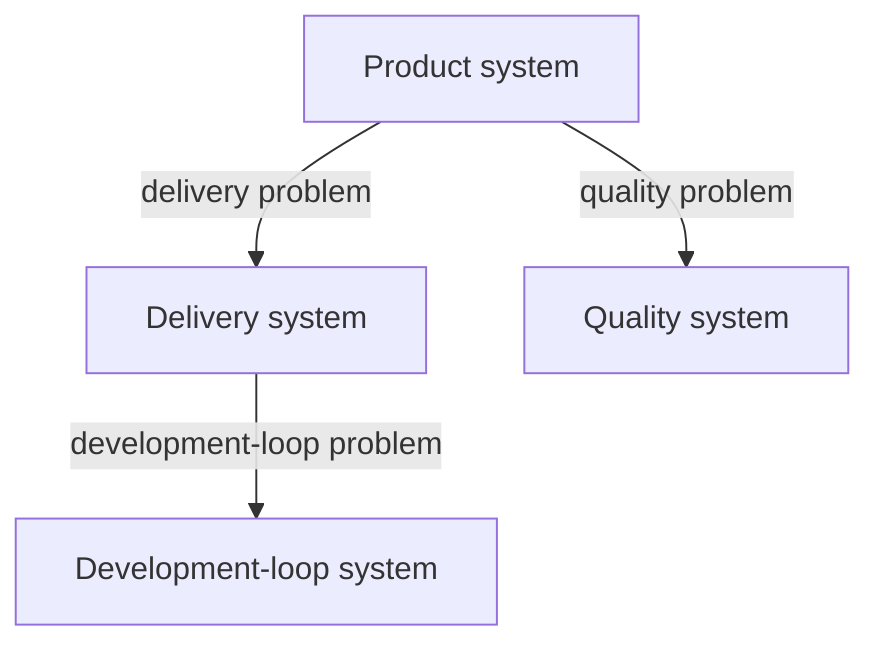
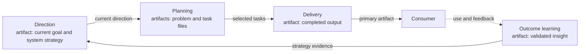
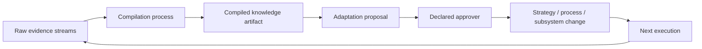
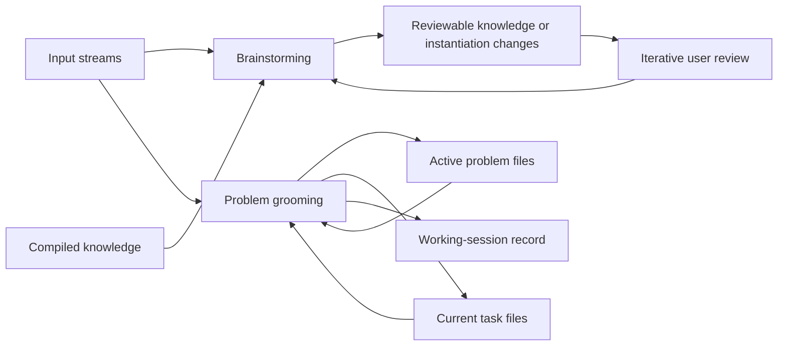
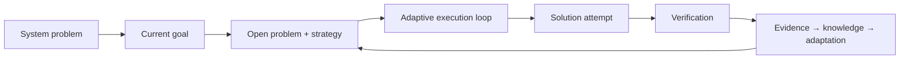

# Visualizing APS

System declarations and their linked strategies, problems, processes, and
streams are the sources of truth. Visualizations are derived projections for
orientation, diagnosis, and improvement. Correct them whenever they conflict
with those sources.

No single diagram should show every relationship. APS uses four standard
views plus a repeatable local-system motif.

## 1. Problem decomposition

Purpose: answer “which larger problems have been decomposed to other systems?”

Derive edges from links in problem definitions, strategies, or processes. Keep
the first view to roughly six to eight systems, then allow readers to zoom into
a selected problem branch.

Node labels contain the system name; edges identify the decomposed problem.
Detail views may add relevant verification signals; do not fill the orientation
map with unrelated streams and process detail.

## 2. Contextual artifact flow

Purpose: when the solution produces artifacts, answer “how do they contribute
to problem improvement, and who uses them?”

Use producer-to-consumer edges labeled with the artifact. Include outcome
feedback when it materially closes the loop.

Use this view only when artifacts materially help explain the solution.

## 3. Evidence, compilation, and adaptation

Purpose: answer “how does this system learn, and where does that learning
change future operation?”

Show raw streams, compilation, knowledge artifacts, adaptation authority, and
the target process or strategy. Use it during maintenance and redesign rather
than as the first view for newcomers.

## 4. Stream, work-session, and artifact processing

Purpose: answer “which bounded work processes which inputs, and what does it
produce?”

Show streams and existing artifacts as inputs to work sessions, with their
authoritative outputs and retained session records. Use this view to distinguish
the sessions from their evidence sources and current-state artifacts.

The system declaration and same-named process remain the source of truth.

## Local-system motif

Every system can be understood through the same compact model:

## Generation contract

A generator derives the views from the minimal declaration and its linked
sources. It should follow the human-readable [declaration contract](SCHEMA.md)
rather than maintaining a second required-field list:

| View | Fields |
|---|---|
| Problem decomposition | System `name` plus links in problem definitions, strategies, or processes |
| Artifact flow | Contextual artifacts and consumers named by the linked processes or problems |
| Learning | `process`, `streams`, and linked learning or adaptation sources |
| Work-session processing | `work_sessions.*`, `streams`, and linked processes |

It should also report structural problems:

- ambiguous system names within the mapped scope;
- unresolved problem-decomposition targets;
- decomposition cycles that are not deliberately modeled feedback;
- systems missing required APS fields;
- unresolved strategy, loop, verification, work-session, or stream process
  references;
- duplicate work-session or stream IDs;
- linked loop processes that omit verification, learning, or adaptation; and
- declarations that reference nonexistent local files.

The generated output is disposable. Never edit generated maps as if they were
the system definition.

## Visual discipline

- Start with the smallest useful view; reveal detail by branch or system.
- Use system names and problem labels, not folder paths, as visible text.
- Pair edge labels with line styles; do not rely on color alone.
- Keep problem-decomposition edges visually distinct from artifact, evidence,
  and governance relationships.
- A diagram with no verification or feedback edge is a prompt to check whether
  the declared loop is actually closed.
