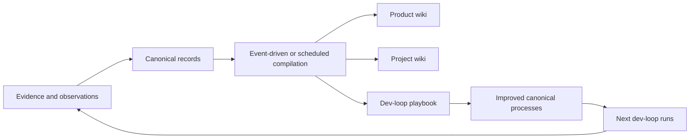
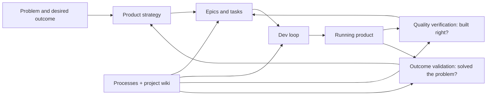
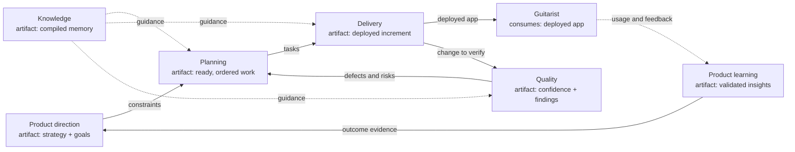

# Initial APSS source discussion

## Scope

This record preserves the original discussion that led to the first APSS
framework definition. It begins with the development-loop learning problem,
continues through the broader system model and one-question-at-a-time framework
grill, and ends when the owner accepts the implementation plan. Tool execution,
implementation progress, and the produced framework text are excluded.

This is retained input for a future application of the normal
[knowledge-compilation process](../processes/knowledge-compilation.md). The
compiler may read this record and that process, but must not read the retained
[expected output](initial-framework-definition.md), the current `framework/`,
or later compiled knowledge before producing its candidate.

## Retained transcript

``````text
===== USER =====
let's tweak the dev loop, at the end of the dev loop there should be record of issues encountered and what solved them
there should be process that goes through them and compiles them to a knowledge artifact and the is used to improve the dev loop
read current project structure and give me a suggestions on how to implement this well


===== ASSISTANT =====
I’ll trace the current dev-loop, work-item, engineering-log, research, and wiki flows, then propose where issue/solution capture and synthesis fit without creating a second competing knowledge system. I’m treating this as a design recommendation only—no files will be changed yet.

===== ASSISTANT =====
The project already has most of the right pieces: per-task logs capture decisions and deviations, `architecture/LOG.md` accepts gotchas/dead ends, and the wiki is explicitly the derived synthesis layer. The missing part is a structured, queryable record of “problem encountered → diagnosis → solution → reuse signal,” plus a defined promotion rule into durable guidance. I’m checking cadence and artifact schemas now so the recommendation aligns with the existing heartbeat and maintenance machinery.

===== ASSISTANT =====
A key design constraint is now clear: `work/issues/` means product defects, so reusing “issues” there for build failures, environment friction, or false starts would pollute triage. The clean design should keep those execution problems inside the completed work item, then promote only recurring or broadly reusable lessons into the derived project wiki and, when justified, back into the canonical process.

===== ASSISTANT =====
The existing task history confirms the gap is practical, not theoretical: useful fixes are already being recorded, but inconsistently and buried in prose—for example alternate Postgres ports and sandbox reruns, Clerk-era E2E drift, and Astro’s agent-environment daemon behavior. The recommendation will standardize that capture, then make promotion selective so the knowledge artifact stays useful instead of becoming an error dump.

===== ASSISTANT =====
The best fit is a closed learning loop inside the existing knowledge system:

`task retrospective → compilation process → wiki playbook → targeted process improvements → next task consults playbook`

No new top-level folder or work-item type is needed.

## Why this fits the project

The current dev loop already requires deviations, failures, reruns, and gotchas to be recorded, but only as unstructured prose in the task Log or `architecture/LOG.md` ([dev-loop.md](/Users/premylsciompa/dev_personal/jazz-master/processes/dev-loop.md:81)). That makes good lessons hard to retrieve.

The history already contains useful examples:

- Postgres port conflict and sandbox rerun in [TASK-055](/Users/premylsciompa/dev_personal/jazz-master/work/tasks/TASK-055-drizzle-migration-foundation.md:99).
- E2E failures caused by missing Hyperdrive configuration and obsolete pre-Clerk expectations in [TASK-067](/Users/premylsciompa/dev_personal/jazz-master/work/tasks/TASK-067-sessions-scores-clerk-postgres.md:140).
- Astro daemonizing under an agent environment and the successful `ASTRO_DEV_BACKGROUND=1` solution in [TASK-035](/Users/premylsciompa/dev_personal/jazz-master/work/tasks/TASK-035-playwright-e2e-smoke-suite.md:89).

These are valuable, but presently require searching long task logs. Meanwhile, the wiki is explicitly designed for derived, cited synthesis ([wiki/README.md](/Users/premylsciompa/dev_personal/jazz-master/wiki/README.md:1)), making it the right compilation destination.

## Recommended design

### 1. Add a structured execution retrospective to every completed task

Add this after the task Log:

```markdown
## Execution retrospective

### <short symptom>

- Type: code | test | tooling | environment | process
- Problem: What failed or caused meaningful friction.
- Cause: Confirmed cause, or `unknown`—never guess.
- Resolution: The action that actually solved or contained it.
- Evidence: Command, test, or observation proving the resolution.
- Reuse: task-only | knowledge-candidate | process-candidate
```

If nothing meaningful happened:

```markdown
## Execution retrospective

No material execution problems encountered.
```

Capture failures that caused a changed approach, rerun, escalation, review fix, blockage, or likely future recurrence. Do not record every typo or normal test-first failure.

This should be part of Step 7 “Record,” before shipping, so it stays in the same commit as the work item. Add its presence to Definition of Done and summarize important entries in the final owner report.

### 2. Keep artifact responsibilities distinct

| Information | Destination |
|---|---|
| Problem and solution during this task | Task’s execution retrospective |
| Reproducible product defect | `work/issues/ISSUE-*` |
| Notable migration, incident, or architectural gotcha | `architecture/LOG.md` |
| Reusable cross-task troubleshooting knowledge | `wiki/project/dev-loop-playbook.md` |
| Rule agents should follow every time | Relevant canonical process document |
| Larger improvement requiring implementation | New `TASK-*` or `INS-*` |

This prevents “issue” from becoming ambiguous: `work/issues/` remains exclusively for product defects.

### 3. Add a dedicated compilation process

I recommend a small new `processes/dev-loop-learning.md`, invoked from knowledge maintenance rather than creating a separate cadence.

Its steps should be:

1. Find completed tasks since the last compilation entry in `wiki/log.md`.
2. Read their `## Execution retrospective` sections.
3. Validate that cause, resolution, and evidence are credible and sanitized.
4. Cluster repeated or closely related problems.
5. Route product defects, architectural decisions, and unfinished improvements to their proper artifacts.
6. Update the compiled playbook by topic—not chronologically.
7. Decide the disposition of every `knowledge-candidate` and `process-candidate`.
8. Update the relevant canonical process when the evidence supports a permanent rule.
9. Update `wiki/index.md`, `wiki/log.md`, and citations.

Because every process file must appear in `AGENTS.md`, add a row such as:

> “Compile task execution problems into reusable lessons / improve processes → `processes/dev-loop-learning.md`”

### 4. Make the compiled artifact action-oriented

Create `wiki/project/dev-loop-playbook.md`, organized by surfaces such as:

- Bun and workspace commands
- Astro and Workers runtime
- Browser/E2E execution
- Postgres and migrations
- Sandbox and permissions
- Review and testing patterns
- Git/shared-tree friction

Each lesson should answer:

```markdown
### Dev server appears to exit when started by Playwright

**When this appears:** Playwright reports that Astro’s web server exited early.

**Likely cause:** Astro detects an agent environment and backgrounds the server.

**Resolution:** Set `ASTRO_DEV_BACKGROUND=1` in the Playwright webServer environment.

**Verify:** Run `bun run --cwd codebase check:e2e`.

**Sources:** TASK-035.
**Promoted to:** `playwright.config.ts` comment; no process change currently needed.
```

The wiki page should synthesize; task logs remain the authoritative evidence.

### 5. Ensure the knowledge is actually reused

Modify dev-loop Step 3 “Plan” to require:

- Consult `wiki/project/dev-loop-playbook.md` for the surfaces being touched.
- Apply relevant known mitigations in the plan.
- If a lesson has become obsolete, correct it during the task using normal wiki-maintenance rules.

Without this query hook, compilation becomes passive documentation rather than process memory.

### 6. Use selective promotion rules

Promote a lesson into a canonical process when:

- The same problem appears in two or more tasks.
- It caused a blocker, security/data-loss risk, or invalid verification.
- It exposes a missing or misleading process instruction.
- A cheap mandatory check would reliably prevent recurrence.

A one-machine port conflict probably remains a playbook entry. A repeated rule such as “auth changes require updating and running the E2E pack” belongs in `testing-strategy.md` or `git-workflow.md`.

## Cadence

Extend the existing knowledge-maintenance sweep—already scheduled roughly every ten tasks ([knowledge-maintenance.md](/Users/premylsciompa/dev_personal/jazz-master/processes/knowledge-maintenance.md:5))—to run the learning compiler.

Allow an earlier heartbeat trigger when:

- The same candidate occurs twice, or
- A single high-impact `process-candidate` is recorded.

The latest compilation marker should come from `wiki/log.md`, preserving the project’s existing principle that cadence is derived rather than maintained through another counter.

## Suggested first implementation slice

One standalone task could:

1. Update `dev-loop.md` and the task template.
2. Add `dev-loop-learning.md`.
3. Add the playbook page, wiki index/log entries, and lifecycle diagram hook.
4. Extend knowledge maintenance and heartbeat triggers.
5. Backfill only recent tasks—starting around TASK-055—not the entire history.
6. Independently review the process change and push it as one knowledge commit.

That gives you structured capture immediately while keeping the initial compilation bounded and useful.

===== USER =====
<environment_context>
  <current_date>2026-07-09</current_date>
  <timezone>Europe/Prague</timezone>
  <filesystem><workspace_roots><root>/Users/premylsciompa/dev_personal/jazz-master</root><root>/Users/premylsciompa/.codex/visualizations/2026/07/09/019f4847-6e2d-7e92-8d2e-0e06703291d1</root></workspace_roots><permission_profile type="managed"><file_system type="restricted"><entry access="read"><special>:root</special></entry><entry access="write"><path>/Users/premylsciompa/dev_personal/jazz-master</path></entry><entry access="write"><path>/Users/premylsciompa/.codex/visualizations/2026/07/09/019f4847-6e2d-7e92-8d2e-0e06703291d1</path></entry><entry access="write"><special>:slash_tmp</special></entry><entry access="write"><special>:tmpdir</special></entry><entry access="read"><path>/Users/premylsciompa/dev_personal/jazz-master/.git</path></entry><entry access="read"><path>/Users/premylsciompa/.codex/visualizations/2026/07/09/019f4847-6e2d-7e92-8d2e-0e06703291d1/.git</path></entry><entry access="read"><path>/Users/premylsciompa/dev_personal/jazz-master/.agents</path></entry><entry access="read"><path>/Users/premylsciompa/.codex/visualizations/2026/07/09/019f4847-6e2d-7e92-8d2e-0e06703291d1/.agents</path></entry><entry access="read"><path>/Users/premylsciompa/dev_personal/jazz-master/.codex</path></entry><entry access="read"><path>/Users/premylsciompa/.codex/visualizations/2026/07/09/019f4847-6e2d-7e92-8d2e-0e06703291d1/.codex</path></entry></file_system></permission_profile></filesystem>
</environment_context>

===== USER =====
how does this fit into the bigger picture?

eg. what are all "data sources" we collect (logs)

eg. what types of "wikis" do we compile

when do we compile them and what it the criteria

who uses each wiki


===== ASSISTANT =====
I’ll map the whole repository as a knowledge pipeline—not just the proposed dev-loop retrospective—so we can distinguish raw evidence, canonical records, compiled views, compilation triggers, and their consumers. I’ll also call out where the current model has deliberate gaps rather than pretending every source needs its own wiki.

===== ASSISTANT =====
The bigger picture has three different things that are easy to blur together:

1. evidence we preserve;
2. canonical records that say what is true or decided;
3. compiled views optimized for reuse.

Only the third category should become wiki pages. Status, research, QA, and regression are also compilations, but they have different freshness and lifecycle rules, so treating all of them as “wikis” would weaken the system. I’m tightening the map around those distinctions now.

===== ASSISTANT =====
The bigger picture is a knowledge refinery:



The proposed execution retrospective adds a missing evidence stream. It does not add another tracker or independent knowledge system.

## 1. What data sources do we collect?

“Data source” here means durable evidence a future agent can inspect. Not all of these are logs in the strict sense.

| Source | What it records | Retention and authority |
|---|---|---|
| `notes/NOTE-*` | Owner thoughts, feedback, grill sessions, meetings, observations | Raw source; preserved, then marked processed |
| Task and issue `## Log` | Plans, decisions, deviations, verification, review results | Canonical record of what happened during work |
| Proposed `## Execution retrospective` | Problem, cause, successful resolution, evidence, reuse potential | Canonical execution-learning source |
| `work/issues/ISSUE-*` | Reproducible product defects and their resolution | Lifecycle-managed factual defect record |
| `work/insights/INS-*` | Product opportunities, friction, ideas | Lifecycle-managed judgment input |
| `work/reviews/REV-*` | Periodic QA/product observations | Immutable review snapshot |
| `work/REGRESSION.md` | Repeatable scenarios and latest browser regression result | Living executable continuity record |
| `work/HEARTBEAT.md` | What accumulated, what was scheduled/skipped, next recommendations | Append-only coordination ledger |
| `architecture/LOG.md` | Migrations, incidents, dead ends, notable gotchas | Append-only engineering history ([LOG.md](/Users/premylsciompa/dev_personal/jazz-master/architecture/LOG.md:1)) |
| ADRs | System-shaping decisions and consequences | Canonical decisions |
| `architecture/overview.md` | Current system shape and operational conventions | Canonical current-state map |
| `research/RES-*` | Questions, evidence, findings, recommendations, sources | Persisted research deliverable |
| Git commits and diffs | Exact code/document history and shipped boundaries | Ultimate audit trail |
| Code and automated tests | Executable behavior and verification contracts | Canonical implementation |
| Cloudflare Workers Logs | Live tRPC outcomes, errors, latency, database smoke status | External operational evidence; owner-access only |
| `wiki/log.md` | What compiled knowledge changed and why | Wiki-maintenance audit log |
| Security review results | Privacy, dependency, permissions and data-risk findings | Recorded inside task/review logs or issues |
| Status report output | Current projection from work frontmatter and git | Intentionally ephemeral; not persisted |

A significant current rule is that full command output is generally not retained. The task Log records the command, outcome, reruns, and meaningful failure evidence. That keeps the repository useful without turning it into a dump of terminal transcripts.

### Major evidence families

These sources can be grouped into five streams:

1. **Human and product evidence** — notes, feedback, grills, QA reviews.
2. **Delivery evidence** — task logs, verification, reviews, retrospectives, git.
3. **Product-continuity evidence** — regression runs, issues, browser observations.
4. **Operational evidence** — Workers logs, deploy/build results, incidents.
5. **External knowledge** — research sources and `RES-*` conclusions.

## 2. What wikis do we compile?

I would keep one physical `wiki/` with three logical families—not create separate top-level wiki systems.

### Product wiki

Location: `wiki/product/`

Answers:

- What does Jazz Master currently do?
- How does the practice loop behave?
- What are the product modules and domain rules?
- What is implemented versus unavailable?
- How do theory, planning, scoring, and persistence behave?

Primary sources:

- Strategy
- Product tasks and issues
- QA and regression evidence
- Architecture overview
- Code/content
- Product research and ADRs

Users:

- Implementing agents planning product changes
- QA and regression agents
- The owner assessing the product
- Researchers who need current product context

Current examples are [product/overview.md](/Users/premylsciompa/dev_personal/jazz-master/wiki/product/overview.md) and [product/theory-engine.md](/Users/premylsciompa/dev_personal/jazz-master/wiki/product/theory-engine.md).

### Project wiki

Location: `wiki/project/`

Answers:

- How does the project operate?
- How does work move from feedback to production?
- How are decisions, reviews, cadence, and knowledge maintained?
- Why are the processes shaped this way?

Primary sources:

- `AGENTS.md`
- Processes
- ADRs
- Heartbeat ledger
- Architecture and research
- Representative work history

Users:

- Agents entering or navigating the repository
- Reviewers checking whether work followed the system
- The owner during status discussions and grills
- Anyone changing the operating model

Current examples include [project/overview.md](/Users/premylsciompa/dev_personal/jazz-master/wiki/project/overview.md) and [lifecycle-of-a-change.md](/Users/premylsciompa/dev_personal/jazz-master/wiki/project/lifecycle-of-a-change.md).

### Dev-loop operational playbook

Recommended location: `wiki/project/dev-loop-playbook.md`

This is a specialized project-wiki page, not a separate wiki.

Answers:

- Have we encountered this failure before?
- What caused it?
- What actually solved it?
- How do I verify the solution?
- Was the lesson promoted into a permanent process rule?

Primary sources:

- Execution retrospectives
- Material review findings
- Failed/rerun verification
- Relevant incidents and `architecture/LOG.md`
- Runtime issues whose causes were confirmed

Users:

- Implementers during planning and debugging
- Reviewers looking for repeated failure patterns
- Knowledge-maintenance agents compiling lessons
- Process authors deciding which lessons deserve permanent rules

The owner should not normally need to read it unless a lesson implies a cost, risk, or workflow decision.

## 3. What should not become a wiki?

Several repository artifacts are compilations, but not wikis:

| Artifact | Why it is not a wiki |
|---|---|
| `RES-*` | Evidence-backed answer to a bounded research question |
| `REV-*` | Time-bounded snapshot of product health |
| `REGRESSION.md` | Executable checklist, optimized for running rather than explaining |
| `HEARTBEAT.md` | Historical coordination ledger |
| Status report | Current projection that should be recomputed, not maintained |
| ADR | Canonical decision, not derived explanation |
| Process document | Canonical instruction agents must execute |
| Architecture overview | Canonical current system map |
| Artifact/presentation | Human-facing rendering of canonical material |

This boundary matters: wiki pages explain durable relationships. They do not hold open work, transient status, uncertainty, or binding rules.

## 4. When do we compile?

There are four compilation modes.

### Event-driven compilation

Run in the same commit when shipped work changes durable “how it works” knowledge.

Examples:

- A feature changes the practice flow → update product wiki.
- An ADR changes persistence architecture → update product and project wiki.
- A process change alters the lifecycle → update project wiki.
- A verified recurring failure produces a new standard solution → update the dev-loop playbook.

This hook already exists in the dev loop’s Record step ([dev-loop.md](/Users/premylsciompa/dev_personal/jazz-master/processes/dev-loop.md:81)).

### Research feed-forward

When research completes:

- Recommendations become code, a task, ADR, process change, rejection, or deferral.
- Durable explanatory findings update relevant wiki pages.
- The wiki cites the `RES-*`; it does not replace it.

### Query-driven compilation

When answering a question requires substantial synthesis that is missing:

- Answer from canonical sources.
- Add or update a wiki page only if future agents are likely to need the same synthesis.

A one-off answer does not automatically justify a page.

### Scheduled compilation and lint

The heartbeat schedules knowledge maintenance after roughly ten shipped tasks or earlier signs of drift. Knowledge maintenance then:

- Compiles new lessons.
- Checks wiki claims against canonical sources.
- Detects missing updates, contradictions, and orphan pages.
- Promotes recurring lessons into processes.

The heartbeat remains the scheduler; knowledge maintenance performs the work.

## 5. What are the compilation criteria?

A piece of evidence belongs in a wiki only when it passes most of these tests:

1. **Durable:** likely to remain useful beyond the current task.
2. **Reusable:** another agent or owner will reasonably ask for it.
3. **Evidence-backed:** cites canonical files or confirmed observations.
4. **Synthesized:** connects multiple facts or makes retrieval materially easier.
5. **Current-state oriented:** explains how something works now.
6. **Stable enough:** not merely an unresolved hypothesis or planned feature.
7. **Has a consumer:** a clear role will use it.
8. **Worth maintaining:** its retrieval value exceeds its staleness cost.

If it fails these tests, it stays in the source task, note, review, issue, or research file.

### Additional criteria for execution lessons

An execution problem enters the dev-loop playbook when:

- It is likely to recur, or it already occurred twice.
- The solution was verified.
- Knowing it earlier would materially save time or reduce risk.
- It is not already documented at the natural point of use.

It becomes a canonical process rule when:

- Recurrence demonstrates a systematic gap.
- One occurrence had blocker, security, privacy, data-loss, or invalid-verification impact.
- A cheap mandatory step can prevent it.
- The rule is broadly applicable, not machine-specific folklore.

## 6. How each compiled artifact gets used

| Compiled artifact | Read when | Main consumer |
|---|---|---|
| Product wiki | Planning product work, QA preparation, answering product questions | Implementer, QA agent, owner |
| Project wiki | Entering the repo, changing processes, reviewing lifecycle compliance | All agents, owner |
| Dev-loop playbook | Planning affected work, diagnosing failures, reviewing repeated friction | Implementer and reviewer |
| Regression pack | Before QA and after high-risk surface changes | Browser/QA agent |
| Research index and `RES-*` | Before researching or making evidence-dependent decisions | Researcher and planner |
| Architecture overview | Before system-shaping work | Implementer and architect/reviewer |
| Heartbeat | Consolidating and scheduling work | Owner and coordinating agent |
| Status projection | Whenever the owner asks what is happening | Owner |

## The proposed retrospective’s exact place

The execution retrospective is:

- **not** a wiki;
- **not** a product issue;
- **not** automatically an architecture-log entry;
- **not** automatically a process change.

It is a new structured source record attached to every dev-loop execution. Knowledge maintenance compiles selected entries into the dev-loop playbook. Strong repeated evidence then updates the canonical processes. Future dev-loop runs consult both the process rules and relevant playbook entries.

That closes the learning loop without weakening the existing distinction between evidence, truth, work, and synthesis.

===== USER =====
should processes also be part of the "wiki" slice? they are currently outside


===== ASSISTANT =====
Logically, processes belong to the same project-knowledge slice. Physically, they should remain outside `wiki/`.

The important distinction is authority:

| Layer | Purpose | Authority |
|---|---|---|
| `processes/` | Executable instructions: what an agent must do | Canonical |
| `wiki/project/` | Explanation and synthesis: how and why the processes fit together | Derived |
| Task retrospectives/playbook | Evidence and reusable operational experience | Source/derived |

Moving or copying processes into `wiki/` would undermine the current “wiki is derived, never canonical” rule and create uncertainty about which instructions agents must follow.

The relationship should be:

```text
execution evidence
    ↓
dev-loop playbook
    ↓
process improvement
    ↓
canonical processes
    ↓
project-wiki explanation
```

Authority flows from `processes/` to the wiki: if they conflict, the process wins. Learning flows in the other direction: retrospectives and compiled lessons can justify changing a process.

What I would improve is navigation, not ownership:

- Keep `processes/*.md` where they are.
- Treat `processes/` and `wiki/project/` as sibling parts of a broader “project knowledge” slice.
- Add a “Canonical operating manuals” section to `wiki/index.md`, linking to `AGENTS.md` and the process catalog without duplicating their content.
- Let project-wiki pages explain relationships across processes.
- Require project-wiki updates whenever a process change materially changes how the system works.
- Require agents to execute the canonical process, not reconstruct instructions from the wiki.

A useful content rule would be:

- “Run these exact nine steps” → `processes/dev-loop.md`
- “The dev loop works this way because it closes delivery, review, and learning” → `wiki/project/lifecycle-of-a-change.md`
- “When Astro behaves like this, this remedy worked” → `wiki/project/dev-loop-playbook.md`
- “Because this problem recurred, always set/check this before E2E” → promote into the relevant process

So I would describe the architecture as one knowledge plane with distinct authority levels:

```text
Project knowledge
├── Canonical direction       strategy/
├── Canonical operations      processes/
├── Canonical decisions       architecture/
├── Evidence and history      notes/, work/, research/, git
└── Derived synthesis         wiki/
```

That gives processes first-class status in the larger knowledge picture without incorrectly making them derived wiki content.

===== USER =====
where does the "problem statement live"? answer in short and concise way


===== ASSISTANT =====
- Product problem: work item’s `## Problem brief`.
- Raw/unvalidated problem: `notes/`, `work/insights/`, or `work/issues/`.
- Execution problem encountered during development: task’s proposed `## Execution retrospective`.
- Durable recurring problem/solution: compiled into `wiki/project/dev-loop-playbook.md`.
- System-level problem motivating a decision: ADR’s `## Context`.

===== USER =====
I mean overall "project" vision/pitch/problem

I see the hierarchy like this

We are solving a problem/goal - Making a tool that allows people to practice jazz easily

then there is a strategy - more detailed approach to solving the problem

there is a product wiki - detailed info aout the solution

project wiki - process - "how tos" on how to go around "daily" tasks, dev loop, how to gather insights etc..., how to grill for more info

then there is a planning - epics, tasks etc...

the last part is the verification loop - qa, testing of issues... we need to somehow verify whether we are solving the overall goal or not

what do you think about this idea, is there something missing, how does that fit the current structure, are we missing something in the current setup?


===== ASSISTANT =====
Your hierarchy is basically right. I’m checking the current vision/goals and product-review criteria to identify the exact missing link between “we shipped correctly” and “we are actually making jazz practice easier.”

===== ASSISTANT =====
Your model is sound. The main missing piece is a distinct outcome-validation loop: the current system is strong at verifying “did we build it correctly?” but weaker at “did this actually make jazz practice easier and more effective?”



## How it maps to the current repository

| Concept | Current home | Assessment |
|---|---|---|
| Overall problem and goal | `strategy/VIS-001-jazz-master.md` | Present, but implicit inside Vision and Success |
| Detailed strategy | Mostly mixed into `VIS-001`, plus `strategy/goals.md` | Present but not clearly separated |
| Current product solution | `wiki/product/` | Good fit |
| Project operating system | Canonical `processes/`, explained by `wiki/project/` | Good fit |
| Planning | `work/epics/`, `tasks/`, `insights/`, `issues/` | Strong |
| Delivery | `processes/dev-loop.md` + codebase | Strong |
| Technical quality verification | Tests, review, regression, security, issues | Strong |
| Product outcome validation | Partly in product practices and QA questions | Not yet operationalized |
| Learning from development | Task Logs today; proposed retrospectives/playbook | Current improvement under discussion |

## What should change

### 1. Make the top-level problem explicit

The authoritative overall problem should live in [VIS-001](/Users/premylsciompa/dev_personal/jazz-master/strategy/VIS-001-jazz-master.md), probably as:

```markdown
## Problem

Intermediate guitarists know what jazz skills they need, but struggle to turn
them into consistent, focused practice. Choosing material creates friction,
feedback is weak, and progress is difficult to see.

## Desired outcome

A guitarist can begin an appropriate practice session immediately, practice
consistently, and develop measurable, transferable jazz-guitar ability.
```

The existing “zero-tension practice” promise and “Success looks like” section already support this; they just do not name the problem directly.

### 2. Separate vision from strategy

Currently `VIS-001` contains problem, promise, differentiators, pillars, non-goals, and success. That is workable, but it mixes two levels.

A cleaner structure would be:

- `VIS-001`: problem, audience, desired outcome, long-term success.
- `strategy/product-strategy.md`: chosen approach, product bets, hypotheses, sequencing, non-goals, risks.
- `strategy/goals.md`: what matters now.

For example, “the app decides, you play” is a strategic bet about how to solve the decision-friction problem.

### 3. Keep two verification loops separate

Quality verification asks:

- Does the feature meet its specification?
- Does it work in browsers?
- Did it regress?
- Is it secure and accessible?

Existing tests, code review, QA, regression, and issues handle this well.

Outcome validation asks:

- Are users beginning practice more easily?
- Are they practicing around four times per week?
- Are sessions appropriate and completed?
- Do they return?
- Are scores, tempos, repertoire, and real playing improving?
- Does ability transfer to playing a standard, rather than only succeeding inside the app?

The current QA process asks some of these questions, but it does not yet collect longitudinal evidence or compare results systematically against the vision.

## Recommended missing process: outcome review

Add a periodic product-outcome review, separate from ordinary QA.

Run it:

- Roughly monthly.
- After a major practice-loop epic.
- Before substantially expanding into another product pillar.

Inputs:

- Practice-session history: practice days, minutes, completion, return frequency.
- Owner dogfooding notes, explicitly labelled n=1.
- Feedback from 3–5 target guitarists once available.
- QA/product observations.
- Progress signals such as score, tempo, consistency, and exercise coverage.
- A small real-playing rubric for transfer outside the app.

Output could remain in `work/reviews/` with something like `review_type: outcome`, avoiding another artifact family.

Each review should conclude:

- Continue the current strategy.
- Deepen a promising area.
- Adjust the approach.
- Run an experiment or gather missing evidence.
- Stop or defer a bet that is not producing the intended outcome.

Its findings feed `INS-*`, tasks, goals, or owner-proposed strategy changes.

## The complete hierarchy

1. **Problem and purpose** — why the project exists.
2. **Vision and desired outcome** — what better looks like.
3. **Strategy** — the bets for getting there.
4. **Product wiki** — how the current solution works.
5. **Project operating model** — canonical processes plus explanatory project wiki.
6. **Planning** — insights, epics, tasks, priorities.
7. **Delivery** — implementation, review, test, ship, learn.
8. **Quality verification** — are we building it correctly?
9. **Outcome validation** — is it changing practice behavior and musical ability?
10. **Strategy feedback** — use outcome evidence to continue, adjust, or stop.

So the current setup is structurally strong. The meaningful gaps are an explicit top-level problem statement, a clearer separation of vision from strategy, and a scheduled outcome-validation loop that tests the product promise rather than only the implementation.

===== USER =====
Few more ideas

- each subsystem should "learn" on it's own, eg. dev loop improving, testing improving, product knowledege is condesed etc...
- this whole vision for how the loop + problem solving in general should be documented too
- the whole system can be thought as hierarchical - each system has a vision (create good dev loop), goal (implement given task in this project), some data stream (log of lessons learned, tasks finished), compiled knowledge - it's wiki slice, some trigger for compilation, a "process" on how to compile it effectively, needs to have some validation/verification - tasks are implemented well, so we can improve , so then the whole project can be though of multiple subsystems with different goals, learning, verification loop, processes that may contain another subsystems


===== ASSISTANT =====
Yes—this is the right abstraction: Jazz Master is a hierarchy of nested learning systems. Each subsystem does work, observes results, verifies them, compiles lessons, and adjusts how it operates.

The important refinement: every subsystem needs **compiled memory**, but that memory is not always a `wiki/` page.

- Explanatory synthesis → `wiki/`
- Binding instructions → `processes/`
- Decisions → ADRs
- Plans → `work/`
- Research conclusions → `research/`
- Test scenarios → `work/REGRESSION.md`
- Raw evidence → logs, notes, reviews, retrospectives

## A common subsystem contract

Each learning subsystem should define:

| Element | Question |
|---|---|
| Purpose | Why does this subsystem exist? |
| Goal | What current result is it trying to produce? |
| Inputs | What information does it consume? |
| Process | How does it operate? |
| Evidence stream | What does it record while operating? |
| Object-level verification | Did this particular run succeed? |
| Compiled memory | What reusable knowledge accumulates? |
| Compilation trigger | When should evidence be synthesized? |
| Compiler process | How is synthesis performed safely? |
| Meta-level validation | Is the subsystem itself getting better? |
| Adaptation | Which process, plan, or strategy can change? |
| Authority | Who may approve those changes? |

The distinction between the two verification levels is especially important:

- **Object level:** Did TASK-075 pass?
- **Meta level:** Is the dev loop reliably producing good tasks with less friction and fewer escaped defects?

## How current subsystems map

| Subsystem | Purpose | Evidence | Compiled memory | Verification | Improvement |
|---|---|---|---|---|---|
| Product | Make jazz practice easier and effective | Sessions, feedback, QA, dogfooding | Product wiki, outcome reviews | Usage and musical outcomes | Strategy, goals, epics |
| Planning | Choose the best next work | Insights, issues, goals, dependencies | Prioritized backlog, heartbeat | Progress toward goals | Triage/prioritization |
| Dev loop | Ship correct increments reliably | Task Logs, retrospectives, review/check failures | Dev-loop playbook | Criteria, review, check, push | `dev-loop.md`, development practices |
| Testing | Catch meaningful defects cheaply | Test failures, escaped issues, flakiness, QA results | Testing strategy, regression pack, quality knowledge | Break-it tests, escaped-defect rate, stable runs | Testing process and coverage |
| Research | Reduce decision uncertainty | External sources and disagreements | `RES-*` | Citation quality, cross-checking, feed-forward | Decisions, tasks, processes |
| Wiki | Prevent repeated re-derivation | Source changes, questions, contradictions | Product/project wiki | Citations, lint, retrieval usefulness | Wiki schema and maintenance |
| Grill loop | Extract owner judgment | Questions, answers, decisions | Notes plus updated artifacts | Owner confirmation and exam grill | Strategy, ADRs, work, processes |
| Knowledge maintenance | Keep the whole system coherent | All repositories of knowledge | Pruned and cross-linked knowledge system | Structural lint and source consistency | Any non-strategy knowledge layer |

## The hierarchy

A parent system gives goals and constraints to its children. Children return evidence upward.

```text
Project: solve the jazz-practice problem
├── Product-learning system
│   ├── User-feedback system
│   ├── QA/product-review system
│   └── Outcome-validation system
├── Planning system
│   ├── Intake and triage
│   └── Prioritization and heartbeat
├── Delivery system
│   ├── Dev loop
│   │   ├── Implementation
│   │   ├── Code review
│   │   └── Testing
│   └── Dev-loop learning
└── Knowledge system
    ├── Research
    ├── Wiki compilation
    ├── Knowledge maintenance
    └── Grill/owner knowledge extraction
```

Testing is a subsystem of delivery, but also has its own learning loop. Wiki maintenance is a subsystem of project knowledge, but it also evaluates and improves its own compilation process. This recursion is legitimate.

## What is already present

Much of this architecture already exists implicitly:

- The heartbeat acts as the conductor that detects due subsystem work.
- Knowledge maintenance acts as a meta-level compiler and linter.
- The wiki is derived memory.
- Task Logs and reviews provide evidence.
- Processes are adaptable operating instructions.
- The monthly exam grill is a form of whole-system validation.

The repo has the components; it lacks the explicit shared model connecting them.

## What is missing

1. **A documented learning-system architecture.**
   The recursive model is not currently stated anywhere.

2. **A subsystem registry.**
   There is no single map showing each subsystem’s purpose, inputs, verification, memory, triggers, and authority.

3. **Consistent execution-learning streams.**
   Dev-loop retrospectives and testing-system lessons are currently buried in prose.

4. **Product outcome validation.**
   Quality verification exists, but longitudinal evidence that the app improves practice is weak.

5. **Meta-verification criteria.**
   Tests are checked for passing, but the testing system is not systematically checked for escaped defects, brittleness, or wasted effort. Similar gaps exist for other processes.

6. **Explicit self-modification boundaries.**
   A subsystem should not freely rewrite its own purpose. For example, the dev loop may improve its mechanics, but it cannot redefine product strategy; strategy remains owner-controlled.

## How to document it

I would use two complementary artifacts:

- A new ADR: the canonical decision that Jazz Master operates as nested learning systems, including the common subsystem contract and authority rules.
- `wiki/project/learning-system.md`: the readable map of all current subsystems, their relationships, triggers, evidence, compiled memory, and consumers.

Then update `wiki/project/overview.md` and the process index to point into that model.

The heartbeat can remain the top-level trigger conductor; it does not need to become the compiler for every subsystem. Each subsystem owns its compilation process, while heartbeat notices when that process is due.

## Sensible implementation order

1. Document the model and subsystem registry.
2. Implement dev-loop retrospectives and compilation as the first concrete example.
3. Add the product outcome-review loop.
4. Add testing-system learning based on escaped defects, flaky tests, and review findings.
5. Only formalize further subsystem loops when repeated evidence shows they need it.

That avoids constructing an elaborate theoretical framework before validating it through one or two real learning loops.

===== USER =====
On ething that is not currenlty obivous - what are current systems and how they are defined hierarchically, suggest how we can create a standard declarative definitions for these systems so they can be easilly map, understood and improved


===== ASSISTANT =====
The project should be modeled as a **primary hierarchy plus typed relationships**. A pure tree is insufficient because, for example, QA belongs to product learning but also verifies delivery.

Not every process is a system. A process becomes a subsystem when it has its own purpose, recurring runs, evidence, verification, compiled memory, and ability to improve independently.

## Proposed current system hierarchy

```text
Jazz Master project
├── Governance
│   ├── Vision and strategy ownership
│   ├── Grill loop
│   └── Architecture decisions
├── Product learning
│   ├── Feedback intake
│   ├── QA/product review
│   └── Outcome validation                 [missing]
├── Work planning
│   ├── Triage
│   ├── Prioritization
│   ├── Heartbeat
│   └── Status reporting
├── Delivery
│   ├── Dev loop
│   ├── Development practices
│   ├── Git/shipping
│   └── Deployment and observability
├── Quality
│   ├── Change testing
│   ├── Code review
│   ├── Security review
│   ├── Regression testing
│   └── Testing-system learning            [implicit]
└── Knowledge
    ├── Research
    ├── Wiki compilation
    ├── Knowledge maintenance
    └── Dev-loop lesson compilation        [proposed]
```

Important cross-system relationships include:

- Dev loop **invokes** testing, review, security, and shipping.
- QA **verifies** the running product and **feeds** product learning.
- Product learning **feeds** planning and strategy.
- Heartbeat **schedules** work across quality and knowledge systems.
- Knowledge maintenance **audits** all knowledge-producing systems.
- Grill/governance **authorizes** changes to strategy and major processes.

## Canonical declarative definitions

I would add:

```text
architecture/systems/
  README.md
  project.md
  governance.md
  product-learning.md
  planning.md
  delivery.md
  dev-loop.md
  quality.md
  knowledge.md
  research.md
  wiki.md
```

These files would be canonical architecture definitions. The project wiki would compile them into a readable explanation and diagram.

Each file would use standardized YAML frontmatter:

```yaml
---
id: dev-loop
title: Dev loop
status: active
parent: delivery
kind: execution

vision: Small, correct increments ship reliably with accumulating learning.
run_goal: Complete and ship one claimed work item.

processes:
  - processes/dev-loop.md
  - processes/development-practices.md
  - processes/git-workflow.md

inputs:
  - work/tasks/
  - work/issues/
  - strategy/goals.md

outputs:
  - codebase/
  - completed work item
  - reviewed and pushed commit

evidence:
  - work-item Log
  - execution retrospective
  - review findings
  - verification results
  - git history

compiled_memory:
  - wiki/project/dev-loop-playbook.md

compilation:
  process: processes/dev-loop-learning.md
  triggers:
    - kind: cadence
      condition: During every knowledge-maintenance sweep
      checked_by: heartbeat
    - kind: condition
      condition: Same material problem appears twice

verification:
  object:
    - Acceptance criteria satisfied
    - Code review completed
    - Check and task verification pass
    - Commit pushed
  meta:
    - Escaped defects are not increasing
    - Repeated friction is being eliminated
    - Verification failures produce reusable lessons

improves:
  - processes/dev-loop.md
  - processes/development-practices.md
  - processes/testing-strategy.md
  - processes/git-workflow.md

authority:
  routine_changes: agent-proposed
  material_changes: owner-confirmed

relations:
  invokes: [quality]
  feeds: [knowledge, planning]
  governed_by: [governance]
---
```

The body can explain nuances, but everything needed to map and lint the system belongs in frontmatter.

## Required system contract

Every active system should declare:

- Identity and primary parent.
- Vision and per-run goal.
- Inputs and outputs.
- Executable processes.
- Evidence stream.
- Compiled memory.
- Compilation process and observable triggers.
- Object-level verification.
- Meta-level validation.
- Adaptation targets.
- Change authority.
- Typed relationships to other systems.

Missing elements should be explicit:

```yaml
compiled_memory: []
gap: No product-outcome review exists yet.
```

That makes incompleteness visible rather than implied.

## Primary hierarchy versus relation graph

Give every system exactly one `parent` for navigation, but allow multiple typed relations:

- `invokes`
- `feeds`
- `verifies`
- `compiles`
- `improves`
- `depends_on`
- `governed_by`
- `scheduled_by`

This produces both:

1. A comprehensible ownership tree.
2. A realistic graph of how information and authority move.

## Validation and tooling

A small deterministic command such as:

```sh
bun run --cwd codebase systems:status
```

could validate and display:

- Unique system IDs.
- Existing, acyclic parent hierarchy.
- Relationships targeting real systems.
- Referenced files and processes existing.
- Every active system having verification and authority rules.
- Every compilation trigger naming who checks it.
- Every process being associated with at least one system.
- Proposed or incomplete learning loops.
- A generated Mermaid hierarchy/relationship graph.

It should report from canonical definitions, not generate or rewrite them.

## How the whole model is documented

Use three layers:

1. **ADR:** canonical decision that Jazz Master is operated as nested learning systems.
2. **`architecture/systems/`:** declarative system definitions and relationships.
3. **`wiki/project/learning-system.md`:** derived human-readable explanation and map.

`AGENTS.md` would point to the system registry, while individual processes remain canonical executable instructions.

## Current gaps this would reveal

- Product outcome validation has no dedicated process, evidence contract, or cadence.
- Dev-loop learning is not structured yet.
- Testing verifies changes, but testing itself has weak meta-validation.
- Current subsystem boundaries are implicit in process documents.
- Compilation triggers are spread across heartbeat, dev loop, and maintenance documents.
- Authority for self-improving processes is not declared consistently.

I would first define only the 7–10 major systems above. Smaller processes should remain components until they demonstrate a need for independent evidence, compilation, and improvement loops.

===== USER =====
shouldn't the stream/wikis etc... be colocated with the system definition?


===== ASSISTANT =====
Yes. If systems become the primary organizing model, each should be a self-contained **system capsule**.

```text
systems/
  dev-loop/
    SYSTEM.md             # purpose, hierarchy, inputs, outputs, authority
    process.md            # canonical execution process
    learning-process.md   # how evidence is compiled
    verification.md       # object- and meta-level checks
    knowledge/
      playbook.md         # compiled reusable memory
    log.md                # system-specific learning/maintenance history
```

However, co-location should follow **ownership**, not duplicate shared evidence.

For example, dev-loop evidence originates in shared task files:

```yaml
streams:
  - type: execution-retrospective
    location: work/tasks/
    selector: "## Execution retrospective"
  - type: review-finding
    location: work/tasks/
    selector: "Review:"
  - type: shipped-change
    location: git
```

Those records remain in `work/` and git because planning, delivery, quality, and knowledge systems all consume them. The dev-loop capsule declares how it reads them.

I would distinguish:

- `systems/<system>/knowledge/` — local compiled memory owned by that subsystem.
- Top-level `wiki/` — cross-system synthesis, such as how the entire project or product works.
- Shared `work/`, `notes/`, git, and runtime logs — event/evidence stores consumed by multiple systems.
- `strategy/` and ADRs — higher-authority inputs that systems reference but do not own.

So the resulting model is:

```text
systems/                    # vertically colocated learning systems
  dev-loop/
  quality/
  planning/
  product-learning/
  knowledge/
  governance/

work/, notes/, git          # shared evidence streams
strategy/, architecture/    # shared authority and decisions
wiki/                       # cross-system compiled synthesis
```

This is cleaner than placing only definitions in `architecture/systems/` while leaving every owned component elsewhere. It would, however, be a significant restructuring of the current layer-based knowledge architecture and should be recorded in a new ADR that amends ADR-003/004/007.

===== USER =====
few more ideas

the information streams may be in some cases eg. async slack threads from cusotmers... meaning there isn't easy standardization

the different streams may have different "grill me" skills to get the relevant info


===== ASSISTANT =====
Exactly. We should standardize the **interface around a stream**, not the stream itself.

A Slack thread, runtime log, owner conversation, task retrospective, and user interview have fundamentally different shapes. Forcing all raw inputs into one schema would discard useful context.

## Three-stage model

```text
Source-native stream
    ↓
Source-specific adapter + grill protocol
    ↓
Normalized evidence
    ↓
System compiler
```

### 1. Source-native stream

Preserve the source in its natural form:

- Slack thread/permalink
- Customer email
- Owner grill transcript
- QA report
- Runtime log
- Task retrospective
- Git history
- User interview recording or notes

The system definition declares where it lives, its privacy level, retention policy, and whether agents can access or respond to it.

### 2. Stream-specific adapter and grill

Each source gets an ingestion/elicitation protocol optimized for that source.

Examples:

- **Customer Slack grill:** What were you trying to achieve? What happened? How often? What is the workaround? What outcome did you expect?
- **Bug-report grill:** Environment, steps, expected/actual, reproducibility, logs, blast radius.
- **Owner-strategy grill:** Which outcome matters? What trade-off is acceptable? What is explicitly out of scope? What would change the decision?
- **Dev-loop retrospective grill:** What blocked progress? What was attempted? What was the confirmed cause? What solved it? How was the solution verified?
- **Product dogfood grill:** What caused practice friction? Did you abandon or continue? What decision did the app force you to make?

For asynchronous sources, the grill does not need to happen immediately. It can produce a durable question queue:

```yaml
state: needs-followup
questions:
  - How often does this happen?
  - Which browser/device were you using?
```

External follow-up—such as messaging a customer in Slack—still requires explicit authority. Otherwise, the questions are routed to the owner.

### 3. Normalized evidence envelope

The common schema should be intentionally small:

```yaml
source:
source_ref:
captured_at:
system:
subject:
observation:
evidence:
confidence:
privacy:
unresolved_questions:
extracted_items:
```

This standardizes provenance and routing without flattening the original conversation.

## Colocation inside a system capsule

```text
systems/
  product-learning/
    SYSTEM.md
    streams/
      customer-slack.md
      owner-dogfood.md
      qa-review.md
    elicitation/
      customer-feedback-grill.md
      owner-product-grill.md
      dogfood-grill.md
    schemas/
      observation.md
    knowledge/
      customer-problems.md
      product-learnings.md
```

A stream declaration could look like:

```yaml
id: customer-slack
kind: external-conversation
location: Slack
access: connector
privacy: customer-confidential
retention: permalink-and-sanitized-summary
trigger: new relevant thread or manual intake
adapter: streams/customer-slack.md
grill: elicitation/customer-feedback-grill.md
normalizes_to: schemas/observation.md
followup_authority: owner-approval-required
```

## Important rule

The compiler should never interpret missing information as fact.

If the Slack thread does not say how often the problem occurs, normalized evidence should say:

```yaml
frequency: unknown
unresolved_questions:
  - How often does this problem occur?
```

So each subsystem owns:

- Its relevant streams.
- Source-specific ingestion adapters.
- Source-specific grill protocols.
- A minimal normalized evidence contract.
- Compilation into subsystem knowledge.
- Validation that provenance, uncertainty, privacy, and unanswered questions were preserved.

This makes heterogeneous external information compatible with the system model without pretending all information arrives cleanly or synchronously.

===== USER =====
how would you call this problem solving framework?


===== ASSISTANT =====
I’d call it the **Nested Learning Systems Framework**.

A nested learning system:

> pursues a goal, executes a process, gathers heterogeneous evidence, compiles reusable knowledge, verifies outcomes, and adapts itself within defined authority.

“Nested” captures the hierarchy and recursion; “learning” captures evidence → knowledge → improvement; “systems” avoids reducing it to only processes or wikis.

Useful tagline:

> **Every system executes, observes, compiles, verifies, and adapts.**

For repository naming:

- ADR: “Nested Learning Systems architecture”
- Wiki: `wiki/project/nested-learning-systems.md`
- Definitions: `systems/<system>/SYSTEM.md`
- Short name: **NLS**

Alternative, more technical name: **Recursive Learning Loop Architecture**. I prefer Nested Learning Systems because it is clearer and less abstract.

===== USER =====
they are not just learniing, the main goal is to problem solve... one thing we may be missing is what is the "artifact" produced by the system... planning creates tasks, delivery produces code, etc.. the whole jazz project produces deployed jazz app


===== ASSISTANT =====
Agreed. “Learning systems” overemphasizes the feedback mechanism. The primary purpose is producing a validated artifact that solves a problem.

I would call the framework:

## Nested Problem-Solving Systems

Definition:

> A hierarchy of systems that transform inputs and constraints into validated artifacts. Each artifact is consumed by another system or user, and evidence from that use improves future transformations.

The core loop becomes:

```text
Problem → Inputs → Process → Artifact → Verification → Outcome → Learning → Improved process
```

## Artifact versus outcome

These must remain separate:

- **Artifact:** what the system produces.
- **Outcome:** the change that artifact should cause for its consumer.

For Jazz Master:

- Problem: jazz practice is difficult to structure and sustain.
- Artifact: deployed Jazz Master application.
- Consumer: intermediate jazz guitarist.
- Outcome: easier, more consistent practice and improved jazz ability.

A perfectly deployed app can still fail to produce that outcome.

## Examples

| System | Primary artifact | Intended outcome |
|---|---|---|
| Jazz Master project | Deployed Jazz Master app | Guitarists practice more easily and improve |
| Product strategy | Prioritized product strategy and goals | Work focuses on the strongest solution bets |
| Planning | Ready, ordered epics and tasks | Delivery works on the highest-value problems |
| Feedback intake | Structured notes, insights, and issues | Raw observations become usable evidence |
| Delivery/dev loop | Shipped product increment | Product capability advances safely |
| Testing | Verification evidence and defect findings | Fewer incorrect changes and escaped defects |
| QA/product review | Review report and filed findings | Product quality and usefulness improve |
| Research | Decision-ready `RES-*` artifact | Decisions use stronger external evidence |
| Grill loop | Confirmed decisions and updated artifacts | Tacit owner judgment becomes explicit |
| Wiki compilation | Current, cited knowledge pages | Less repeated derivation and better decisions |
| Knowledge maintenance | Coherent, pruned knowledge repository | Knowledge remains trustworthy and actionable |
| Dev-loop learning | Playbook and process improvements | Delivery becomes more reliable and efficient |

## Revised system contract

Every system definition should declare:

1. Problem it owns.
2. Consumer or parent system.
3. Intended outcome for that consumer.
4. Inputs and constraints.
5. Transformation process.
6. Primary artifact.
7. Supporting artifacts.
8. Artifact acceptance criteria.
9. Outcome-validation method.
10. Evidence streams.
11. Knowledge compilation process and trigger.
12. Adaptation targets and authority.

Example:

```yaml
problem: Planned work must become a safe, usable product increment.
consumer: jazz-master-project
outcome: Product capability advances without regressions.

primary_artifact:
  type: deployed-increment
  locations:
    - codebase/
    - git
    - deployed-worker
  acceptance:
    - task criteria satisfied
    - review complete
    - checks green
    - pushed and deployed

evidence:
  - task Log
  - execution retrospective
  - review findings
  - verification results
  - runtime incidents

learning:
  compiled_artifact: systems/dev-loop/knowledge/playbook.md
  compilation_process: systems/dev-loop/learning-process.md
  improves:
    - systems/dev-loop/process.md
```

A useful boundary rule follows:

> If something has no distinct problem, consumer, artifact, and validation method, it is probably a process step or capability—not an independent system.

The learning loop remains essential, but it supports the primary transformation:

> **Each system solves a problem by producing an artifact, verifies its effect, and learns how to produce a better artifact next time.**

===== USER =====
one more thing - is there a good way to visualize these systems? what would you suggest ?

to quickly orient youtself in the setup...


===== ASSISTANT =====
I’m using the visualization skill because this is exactly a “quick orientation map” problem. I’ll suggest a small set of complementary views rather than one overloaded diagram, and show which should be the default entry point.

===== ASSISTANT =====
Use three generated views rather than one overloaded diagram. The best default is an **artifact-flow map** because it immediately shows why each system exists and what it contributes.



## The three views

1. **Artifact flow — default orientation**

   Shows `system → artifact → consumer`. Answers: “How does this project turn a problem into a deployed app?”

2. **Hierarchy view**

   Uses only `parent` relationships. Answers: “Where does this subsystem belong?” Expand a node to see children such as dev loop, testing, or wiki compilation.

3. **Learning view**

   Shows evidence streams, compilers, knowledge artifacts, verification, and which processes they improve. Use this when maintaining a subsystem—not for first orientation.

## Local system view

Every `SYSTEM.md` should also render the same small motif:

```text
Problem → Process → Artifact → Consumer
             ↑                    ↓
      Improved process ← Knowledge ← Evidence/validation
```

That visual consistency makes unfamiliar systems predictable.

## Generate views from definitions

The declarative fields provide the graph:

```yaml
parent: delivery
produces:
  artifact: deployed-increment
  consumed_by: jazz-master-project
relations:
  verified_by: quality
  feeds: product-learning
learning:
  evidence: execution-retrospectives
  compiled_to: knowledge/playbook.md
  improves: process.md
```

A `systems:map` command could generate:

- `systems/index.md` — top-level orientation and hierarchy.
- `wiki/project/system-map.md` — cross-system explanation.
- A local diagram inside each system capsule.
- Validation warnings for missing consumers, artifacts, parents, or verification.

Keep the first map to roughly 6–8 top-level systems. Details should appear only after selecting or opening a system; otherwise the orientation map becomes the thing people need help understanding.

===== USER =====
okay, now the goal is to document / define - produce a definition document from what we discusesed/learned defined that describes what this system is, why we have, how it works, clear definitions on how to create one and how to visualize them etc...

then we will want to refactor current system using this new framwork, create clear definitions document it and then use it to continue with development

first grill me for all unclear things in the sense of what we just discussed and then continue in this task one you have all info


===== ASSISTANT =====
I’m switching into the project’s grilling process: one load-bearing question at a time, anchored to the framework definition we will create. I’ll preserve the decisions as we go, then implement the agreed documentation and refactor only after the open questions are resolved.

===== ASSISTANT =====
Proposed grill agenda:

1. Framework scope and naming.
2. Required definition of a problem-solving system.
3. System boundaries, hierarchy, artifacts, consumers, and outcomes.
4. Streams, source-specific adapters, and grill protocols.
5. Colocation and repository structure.
6. Compilation, verification, learning, and self-modification authority.
7. Visualization and mechanical validation.
8. Migration of the current Jazz Master setup and rollout order.

Does this cover the decisions you want settled before implementation, or should the agenda change?

===== USER =====
one note on grilling in general - ask 1 questions at a time, asking multiple ones without context overwhelms the user


===== ASSISTANT =====
Understood. I’ll give context, then ask exactly one question at a time.

First: should **Nested Problem-Solving Systems** be defined as a reusable framework for any project, with Jazz Master as its reference implementation, or only as Jazz Master’s internal operating model?

===== USER =====
any system, in next steps I want to see if it works on other problems, eg. how to improve the problem solving systems themselves


===== ASSISTANT =====
Decision captured: the framework is domain-independent and recursively applies to systems that improve other problem-solving systems.

Should every valid system produce a durable artifact, or can its primary artifact be a **verified state change**—for example, “the knowledge base is coherent” or “the dev loop is improved”—with only an evidence record documenting that change?

===== USER =====
in some cases the wiki itself can be the artifact


===== ASSISTANT =====
Agreed—the wiki can be the primary artifact when the problem is knowledge synthesis.

Should we define **artifact** broadly as any inspectable output—code, plan, decision, wiki, report, or recorded state transition—while still requiring every system to name at least one primary artifact?

===== USER =====
in limit it cna be even something phsyical - eg. use automated CNC to create physical product based on cad design


===== ASSISTANT =====
Captured: an artifact may be digital, informational, decisional, a recorded state change, or physical. The framework is implementation-medium agnostic.

Should every system separately define:

- **artifact acceptance** — was the output produced correctly?
- **outcome validation** — did that output solve the consumer’s problem?

For example, a CNC part can match the CAD tolerances yet still fail in its real use.

===== USER =====
I see these as 2 different parts of the validation that both need to be validated separately - the exact validation will depend on the problem itself


===== ASSISTANT =====
Captured: validation has two mandatory, problem-specific parts—artifact correctness and real-world outcome effectiveness.

For information streams, should the framework require preserving the raw source or a stable reference whenever possible, while allowing a sanitized summary to become the retained source when privacy, access, or retention rules prevent keeping the original?

===== USER =====
I would say we always want the raw data, in some cases it may be worth to re run to the compilation

eg... we learn that some aspect in data is important.. we add it to strategy.. we recheck old data to get new "snapshot" of the knowledge


===== ASSISTANT =====
Captured: raw evidence is immutable source material; compiled knowledge is disposable and may be regenerated when strategy, schemas, or important questions change.

For external sources such as Slack, must raw data be copied into the system’s own storage, or is a durable reference to the external system of record acceptable—with loss of access explicitly treated as a provenance gap?

===== USER =====
I consider that implementation detail, in some cases it may make sense to copy it, in some reference is enough


===== ASSISTANT =====
Captured: the framework requires recoverable raw evidence and provenance, but copying versus referencing is an implementation decision of each system.

For hierarchy, should every subsystem have exactly one primary parent for ownership and orientation, while allowing additional typed relationships such as `feeds`, `verifies`, and `invokes` across the hierarchy?

===== USER =====
give me an example


===== ASSISTANT =====
Example: the QA/product-review system touches several systems.

```text
Jazz Master project
├── Delivery
├── Quality
│   └── QA/product review
├── Product learning
└── Planning
```

Its definition could say:

```yaml
parent: quality

relations:
  verifies: delivery
  observes: deployed-product
  feeds:
    - product-learning
    - planning
  scheduled_by: heartbeat
```

QA appears once under `quality`, which owns and maintains it. But its findings flow into product learning and planning.

If it had multiple parents—`quality` and `product-learning`—ownership of its process, compilation, and validation could become unclear.

Should we adopt the single-primary-parent plus typed cross-relationships model?

===== USER =====
what do you think? what are cons/pros


===== ASSISTANT =====
I recommend **one primary parent plus typed cross-system relationships**.

### Advantages

- Clear ownership: one system maintains the child’s definition, process, and compiled knowledge.
- Clear authority: there is one escalation path when the subsystem changes.
- Reliable colocation: the subsystem has one physical home.
- Simple hierarchy: orientation maps remain readable.
- No duplicate scheduling: one parent owns cadence and compilation triggers.
- Recursive reasoning stays possible: each parent can validate its children.
- Alternative views can still show the system wherever it participates.

### Disadvantages

- Choosing the primary parent can sometimes feel arbitrary.
- A hierarchy alone may hide cross-cutting importance.
- Moving ownership later may require changing paths and references.
- Readers might incorrectly assume the parent is the system’s only consumer.

Typed relationships address most disadvantages:

```yaml
parent: quality        # owns the system
verifies: delivery     # what it checks
feeds: product-learning
scheduled_by: heartbeat
governed_by: governance
```

Allowing multiple parents looks more accurate initially, but creates harder problems:

- Which parent may change the subsystem?
- Which parent schedules it?
- Where are its files colocated?
- Which parent validates it?
- Could both parents trigger duplicate compilation?
- What happens when their goals conflict?

So I would make `parent` mean **lifecycle ownership**, not “the only system this belongs to.” Visualizations can project QA under product learning or delivery without changing its canonical parent.

Do you want to adopt that ownership interpretation of `parent`?

===== USER =====
makese sense, clear ownership is key


===== ASSISTANT =====
Captured: every subsystem has one primary parent responsible for its lifecycle; cross-system participation is expressed through typed relationships.

Should `systems/<id>/` become the canonical home for system-owned definitions, processes, verification rules, and compiled knowledge—even though that means moving much of today’s `processes/` and parts of `wiki/`—or should the first version leave existing files in place and use system capsules mainly as references?

===== USER =====
yes - will the hierarchical systems live in a subfolder of parent?


===== ASSISTANT =====
Yes. Since `parent` means lifecycle ownership, the filesystem should mirror it:

```text
systems/
  jazz-master/
    SYSTEM.md

    governance/
      SYSTEM.md
      grill/
        SYSTEM.md

    product-learning/
      SYSTEM.md
      feedback-intake/
        SYSTEM.md
      outcome-validation/
        SYSTEM.md

    planning/
      SYSTEM.md
      triage/
        SYSTEM.md

    delivery/
      SYSTEM.md
      dev-loop/
        SYSTEM.md
        process.md
        learning-process.md
        knowledge/
          playbook.md

    quality/
      SYSTEM.md
      testing/
        SYSTEM.md
      regression/
        SYSTEM.md
```

Cross-system relationships remain references, never duplicate folders. Shared evidence such as task records and external streams can remain outside the capsule and be declared as inputs.

Should every system also have a stable ID independent of its path, so it can move to a different parent without breaking all relationships? For example, `id: jazz-master.dev-loop` could remain stable even if its folder moves.

===== USER =====
yeah, unique ids/names make sense to me

one random note, all of the meetings, discussions, drilling etc should be also covered as stream, summaries are probably enough - eg. this discussion, in companies, these would be "meetings" on given topics

one concept in the flow of hte problme solving should be to prompt for discussions with a user (in case of automated AI system), in company setting this would be with a collegeau, or another prompt could be to schedule a research on a given topic that is unclear - eg. right now we could go on the internet, read books on similar topics and compile knowledge from that, I can imagine that every system will need these 2 concepts, like eg. grilling


===== ASSISTANT =====
Captured:

- Systems have stable IDs independent of paths.
- Meetings, discussions, and grills are evidence streams; a topic-focused summary can be their durable source record.
- Every system needs an explicit way to resolve uncertainty by invoking shared capabilities rather than duplicating them:
  - **Discussion/grill:** obtain judgment or tacit knowledge from people.
  - **Research:** compile existing external knowledge.

I think one universal route is still missing: **experimentation**—generate new evidence when neither people nor existing sources can answer confidently. Examples include a prototype, feasibility spike, user test, benchmark, or controlled trial.

Should every system declare these three uncertainty-resolution routes: discussion, research, and experiment?

===== USER =====
great idea => experimentation + gathering feedback from that is also general concept, eg. create a prototype of an app and let user's test it


===== ASSISTANT =====
Captured: experimentation is a universal evidence-generation route, and its observations and user feedback become new system streams that can trigger recompilation or strategy changes.

I recommend a hybrid model:

- The framework defines shared interfaces for **discussion**, **research**, and **experimentation**.
- Each system declares when it invokes them and supplies domain-specific protocols—for example, its own grill questions, research brief, experiment design, and validation criteria.
- Execution may be delegated to reusable shared systems.

Should we adopt that shared-capability plus system-specific-protocol model?

===== USER =====
one thing to experiments - in math this can be proving a theorem, that is basically also an experiment

yes, let's do it


===== ASSISTANT =====
Captured: “experiment” means any deliberate method for generating new evidence, including prototypes, user trials, simulations, benchmarks, formal proofs, and theorem proving.

Should the framework require a candidate to have its own problem, owner, artifact, consumer/outcome, validation, evidence stream, and adaptation loop before it qualifies as an independent **system**—otherwise treating it as a process or capability inside another system?

===== USER =====
I think so, what do you think?


===== ASSISTANT =====
I agree with the principle, but I would avoid requiring every small subsystem to own a separate learning apparatus.

Minimum for an independent system:

- Distinct problem and boundary.
- Responsible owner or authority.
- Inputs and transformation process.
- Primary artifact.
- Consumer and intended outcome.
- Artifact validation and outcome validation.

Learning is mandatory, but it may be delegated:

```yaml
learning:
  mode: owned | delegated
  delegated_to: delivery
```

This prevents tiny systems from needing their own wiki, compiler, cadence, and log while ensuring their evidence still improves something.

If an entity lacks its own artifact and outcome, it is a process or capability. If it has those but delegates learning, it is an operational subsystem. If it owns compilation and adaptation, it is a fully adaptive problem-solving system.

Should we adopt these three levels: **capability/process**, **operational system**, and **adaptive system**?

===== USER =====
I think every subsystem should also be adaptive and own it's learning

that's a good name - Adaptive Problem Solving systems


===== ASSISTANT =====
Captured:

- Framework name: **Adaptive Problem-Solving Systems (APSS)**.
- Every declared system is adaptive and owns its evidence, compilation, validation, and improvement loop.
- Anything too small to own that loop remains a process or capability inside a parent system.

When a system learns that its process should change, may it apply that improvement automatically within declared boundaries, or must it always produce a proposed change for approval by its owner/parent?

===== USER =====
that should depend on system declaration ,for now these should be human approved (can be different humans in companies), but in long run, these systems could be independent if they are good enough


===== ASSISTANT =====
Captured: adaptation authority is declared per system. The initial default is human approval by the responsible owner; autonomous self-modification is an allowed future mode only when the system has earned sufficient trust.

To make recompilation auditable, should every compilation run produce a manifest recording the source set, questions/strategy used, compiler version or process, timestamp, and resulting artifact—even when the artifact itself is a living wiki page?

===== USER =====
I think that is overkill, we have all that info in git anyway, there should be just simple changelog to the wiki to catch up on new things


===== ASSISTANT =====
Captured: no per-run manifests. Git provides detailed provenance; each compiled knowledge artifact keeps a simple changelog for incremental catch-up.

Should every system declare two compilation modes:

- **Incremental:** incorporate new evidence since the last update.
- **Full recompilation:** revisit all available raw evidence when the problem framing, strategy, schema, or important questions materially change?

===== USER =====
I think that should be internal process that depends on details, it may be even resource question, how much time/tokens there it


===== ASSISTANT =====
Captured: incremental versus full compilation is an internal system decision based on source shape, risk, and available time/token/resource budget—not a universal framework requirement.

Should the framework still require each system to declare **when compilation is due**—event, cadence, staleness condition, or on-demand—even though the compilation process decides how much evidence to revisit?

===== USER =====
it should just require that this process is "implemented"


===== ASSISTANT =====
Captured: APSS requires every adaptive system to implement its own compilation process. That process owns its triggers, scope, budget, and incremental/full strategy.

For visualization, should hierarchy, artifact-flow, and relationship maps be generated mechanically from each `SYSTEM.md` declaration so they cannot drift from the system definitions?

===== USER =====
that would be great if possible


===== ASSISTANT =====
Captured: system maps should be generated from declarative definitions where practical; manual diagrams are derived views, never another source of truth.

Should APSS itself be defined as an adaptive system—whose artifact is the framework specification and whose consumers are system designers—so the framework can collect evidence from Jazz Master and other applications and improve itself recursively?

===== USER =====
not right now, maybe in future


===== ASSISTANT =====
Captured: APSS is currently a framework specification, not an APSS adaptive-system instance. Making the framework self-improving is a future possibility.

Should the reusable framework live in a dedicated top-level `framework/apss/` directory, separate from concrete instances under `systems/`?

===== USER =====
yes, for now, I will move it elsewhere later

one more observation I just had - the system needs to define a full execution loop that includes learning, that is must have, it can be async in some cases, or a "cron", but that is the main point to have full feedback loop


===== ASSISTANT =====
Captured: every APSS instance must define a complete feedback loop, including execution, both validations, evidence capture, compilation, adaptation, and the next invocation. The loop may be synchronous, asynchronous, event-driven, scheduled, or continuous.

Should APSS require these responsibilities without prescribing a fixed sequence—allowing systems to reorder, combine, or run phases concurrently as long as the full loop is closed?

===== USER =====
yes, how exactly it works is flexible depending on problem - that is it's "strategy" that may also evolve - the loop itself can change, more subsystems can be created if needed

one more idea - some systems may be autonomous in sense, they have a "health check", eg. company needs to make money otherwise it dies... so part of hte loop is to maintain homeostasis - check and then adapt to keep some condition "healthy"


===== ASSISTANT =====
Captured: the system’s execution strategy is evolvable. Learning may change the loop itself, create or retire subsystems, and alter how work is performed—subject to declared authority.

Homeostasis is distinct from the two validations:

- Artifact validation: was the output correct?
- Outcome validation: did it solve the consumer’s problem?
- Health validation: can the system continue operating within viable conditions?

Should every system be required to declare health conditions—or explicitly state that none are currently needed—so sustainability is always considered without forcing artificial metrics?

===== USER =====
not every system, ønly open ended system, we should document this may be the case in some scenarios, but not in all


===== ASSISTANT =====
Captured: homeostasis is an optional pattern for open-ended or continuously operating systems, not a universal requirement. APSS will explain when to add health conditions and adaptive control.

Before drafting the framework, should I run a focused research phase comparing APSS with systems engineering, cybernetics/control loops, OODA/PDCA, double-loop learning, the Viable System Model, and evidence-based experimentation—so we can reuse established ideas and clearly state what APSS adds?

===== USER =====
not right now, let's schedule that for next steps (make a task inside the framework?)


===== ASSISTANT =====
Captured: external research is deferred as explicit follow-up work owned by the APSS framework, not required before the initial definition.

This raises a structural question: should every system capsule own its own local `work/` queue—tasks, experiments, research, and unresolved questions—with parent systems aggregating and prioritizing child work instead of using one global `work/` directory?

===== USER =====
it feels to me that every system will need a planning to make the loop work, what do you think?


===== ASSISTANT =====
Every adaptive system needs a **planning function**, because it must choose what to do next from its problem, goals, evidence, constraints, and learning.

But not every system needs a persistent backlog:

- A short synchronous system may calculate its next action in memory.
- An asynchronous or multi-actor system needs durable tasks, experiments, questions, and priorities.
- A parent system may allocate resources and constraints while each child plans its own execution.

So APSS should require:

```yaml
planning:
  process: <how next actions are chosen>
  artifact: <plan, queue, schedule, decision, or transient action selection>
  persistence: transient | durable
  coordinated_by: <self or parent system>
```

Should we adopt the distinction that **planning is mandatory**, while a durable local `work/` queue is required only when the system’s plan must survive across runs, actors, or time?

===== USER =====
I think work log is a good practices in general, if we have log, we can also have a durable plan


===== ASSISTANT =====
Captured: every system should maintain a durable work log and durable plan. This makes execution resumable, auditable, and available as learning evidence; local `work/` is therefore part of the standard system capsule.

Should APSS standardize only a minimal work-item envelope—ID, type, status, goal, source, owner, timestamps, outcome, and log—while allowing each system to define domain-specific item types such as task, experiment, theorem, issue, question, or decision?

===== USER =====
let's define general types, but not force them


===== ASSISTANT =====
Captured: APSS will provide recommended general work types—task, issue, insight, question, decision, research, experiment—but systems may use, extend, or ignore them.

Should each information stream have a declaration covering its source, access, provenance, retention, ingestion process, privacy constraints, and optional source-specific discussion/grill protocol?

===== USER =====
maybe not in such detail, eg. privacy is too much, but grill protocol seems general


===== ASSISTANT =====
Captured: stream declarations should stay lightweight. Privacy, retention, and normalization are system-specific concerns, not universal APSS fields.

Would this minimum be sufficient: stream ID, purpose, source/location, capture or access method, consuming process, and optional discussion/grill protocol?

===== USER =====
yeap, sounds good


===== ASSISTANT =====
Captured: lightweight stream declarations use ID, purpose, source/location, access method, consumer, and optional discussion/grill protocol.

Should every system identify its owner, operators, artifact consumers, validators, and adaptation approvers—allowing one person or agent to hold several roles?

===== USER =====
yes


===== ASSISTANT =====
Captured: every system declares owner, operators, artifact consumers, validators, and adaptation approvers; people and agents may hold multiple roles.

Should `SYSTEM.md` use validated YAML frontmatter for the machine-readable contract and Markdown for explanation, with systems allowed to add custom fields beyond the APSS core schema?

===== USER =====
yes


===== ASSISTANT =====
Captured: `SYSTEM.md` has validated core YAML plus explanatory Markdown; systems may extend the schema.

For this implementation, do you want me to:

- first ship the APSS specification, template, example, visualization rules, and follow-up research task as one reviewed increment;
- then perform the Jazz Master migration as separate planned increments using that accepted specification?

This avoids changing the whole repository against an unreviewed first draft.

===== USER =====
sounds good


``````
